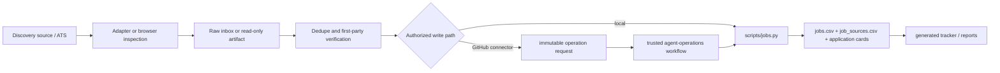

# Current project architecture

Статус: current — 2026-08-14

Этот документ описывает работающую архитектуру репозитория. Обязательные
поведенческие правила находятся в [`AGENTS.md`](../AGENTS.md), точная схема — в
[`data/schema.md`](../data/schema.md), а карта всей документации — в
[`docs/README.md`](README.md).

## Источники истины

| Данные | Роль |
|---|---|
| `data/jobs.csv` | единственный canonical список вакансий и lifecycle заявки |
| `data/job_sources.csv` | many-to-one provenance внешних источников; не существует без canonical job |
| `applications/job-*.md` | длинный контекст вакансии и материалы; не заменяет CSV facts |
| `config/profile.md` | подтверждённый профиль кандидата, ограничения и доказательства |
| `config/sources.toml` | машинная политика включённых discovery adapters |

`docs/tracker.md`, reports, operation results, raw batches и workflow artifacts
не являются вторыми источниками истины.

## Поток данных



Discovery никогда не подтверждает актуальность вакансии автоматически.
Aggregator/API record становится canonical только через dedupe, проверку
первоисточника и разрешённый write path.

## Слои и каталоги

```text
config/                     candidate profile, queries, source registry
docs/sources/               source- and ATS-specific playbooks
scripts/import_*.py         fetch-only discovery adapters
data/inbox/                 local immutable JSONL batches (Git-ignored)
data/operations/            connector requests and immutable results
data/jobs.csv               canonical jobs
data/job_sources.csv        canonical provenance references
applications/               long-form job context
scripts/jobs.py             local canonical write path and projections
scripts/agent_operations.py trusted declarative connector executor
.github/workflows/          validation, operation runner, read-only discovery
docs/tracker.md             generated browser projection
reports/                    periodic derived reports
tests/                      policy, transaction and workflow regression tests
```

## Write paths and trust boundaries

Local writes go through `scripts/jobs.py`. The GitHub connector may create one
immutable JSON request but cannot edit canonical CSV or executable policy. The
trusted workflow validates the request, applies it through the same jobs
functions, validates the whole dataset, regenerates the tracker and restricts
changed paths before committing.

Atomic batches may mix existing-job updates and new `add` children. Add IDs are
assigned only inside the isolated transaction and returned through stable
`client_ref` mappings. Any child conflict leaves the canonical dataset
unchanged.

## Discovery surfaces

- Browser/manual discovery follows `docs/sources/*.md` and records every
  inspected exact vacancy.
- Himalayas has a fetch-only adapter for narrow/broad query matrices.
- `data/inbox/*.jsonl` supports local immutable batch ingest.
- `.github/workflows/source-discovery.yml` produces a temporary read-only
  artifact for connector/runner use and never changes canonical files.

Artifacts contain exact UTC run timestamps. Tracker calendar dates such as
`found_at`, `verified_at` and `last_update` use `Europe/Belgrade`, independent
of the runner's system timezone.

## Derived views and validation

`docs/tracker.md` is deterministically rendered from canonical data. A valid
write is complete only after:

1. strict dataset validation;
2. tracker regeneration and exact freshness check;
3. unit tests;
4. duplicate review;
5. for connector operations, immutable result and changed-path enforcement.

The CI workflow validates pushes to `main`, pull requests and manual runs. The
operation workflow owns canonical connector writes; the source-discovery
workflow has read-only repository permission.

## Evolution rule

Current architecture changes are documented in the same commit using the
matrix in [`docs/README.md`](README.md). Historical plans remain historical; the
current documents are not reconstructed from them.
