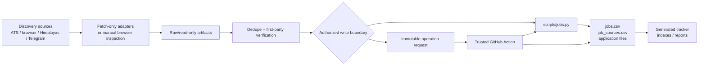
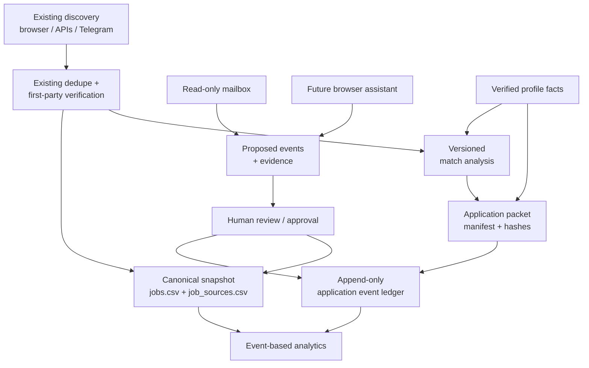
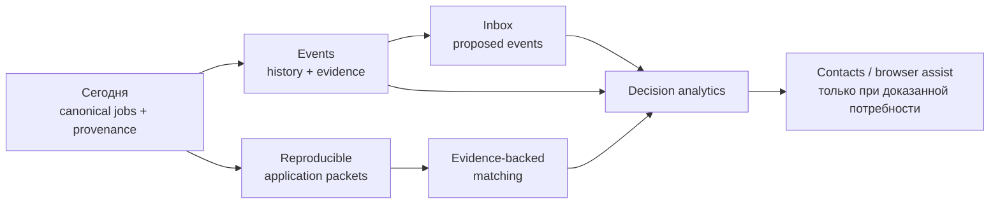

# Глубокий сравнительный аудит `job-searcher` и публичных GitHub job-tracker проектов

## Исполнительное резюме

Исходный документ [`github-job-tracker-inspiration-analysis-2026-09-22.md`](https://github.com/stupidkubik/job-searcher/blob/main/docs/github-job-tracker-inspiration-analysis-2026-09-22.md) в целом оказался **технически сильным и направленно верным**. Он не просто перечисляет конкурирующие приложения, а правильно выделяет несколько архитектурных паттернов: opportunity как сущность выше URL объявления, разделение listing/application lifecycle, evidence-backed matching, подтверждаемые изменения состояния, application packet, proposed events из почты и человеческое подтверждение необратимых действий. Сам документ подчёркивает, что это исследование, а не implementation plan, и называет существующие `jobs.csv`, `job_sources.csv`, `profile.md` и документированные контракты источниками истины. fileciteturn0file0L2-L2

Главный вывод аудита: **`job-searcher` не следует превращать в очередной Kanban/CRM SPA и не следует переписывать на PostgreSQL только ради визуального сходства с другими проектами**. Его наиболее редкое конкурентное преимущество уже существует: Git-аудируемая canonical memory, отдельный provenance, first-party verification, изоляция discovery, строгий write path и явная граница между фактом объявления и фактом действий кандидата. Текущая архитектура действительно строится вокруг `data/jobs.csv`, `data/job_sources.csv`, immutable/raw artifacts и авторизованных операций, а GitHub Actions используется не как обычный deployment pipeline, а как контролируемая execution plane для проверяемых изменений canonical state. fileciteturn5file0L2-L2 fileciteturn65file0L2-L2

Наиболее существенный функциональный пробел находится **после discovery и screening**. Существующая схема умеет хранить `applied_at`, `response_at`, текущий `application_status`, максимальный `stage_reached` и next action, но это snapshot, а не полная история переходов. `stage_reached` монотонно растёт, тогда как реальный процесс состоит из событий: invitation, assessment, recruiter screen, reschedule, rejection, withdrawal, follow-up, offer и т. д. fileciteturn63file0L2-L2 Это полностью совпадает с выводом исходного документа: post-apply event history, inbox reconciliation и воспроизводимость конкретного application packet сейчас дают больший marginal value, чем ещё один источник вакансий. fileciteturn0file0L2-L2

Мой приоритет для `job-searcher`:

| Приоритет | Изменение | Ценность | Оценка усилий |
|---|---|---:|---:|
| **P0** | Append-only application event ledger поверх текущего snapshot | Очень высокая | Средняя |
| **P0** | Versioned application packet manifest с hash/provenance материалов | Очень высокая | Низкая–средняя |
| **P1** | Разложить `match_score` на eligibility / evidence / confidence / preference | Очень высокая | Средняя–высокая |
| **P1** | Source-health и observation-freshness без автоматического `closed` | Высокая | Низкая–средняя |
| **P1** | Read-only inbox reconciliation → proposed events → human approval | Очень высокая | Высокая |
| **P2** | Event-based funnel/time-to-stage/follow-up analytics | Высокая после event ledger | Низкая–средняя |
| **P2** | Отдельный contact/outreach ledger | Средняя–высокая | Средняя |
| **Отложить** | Browser autofill/extension | Средняя, высокая эксплуатационная цена | Высокая |
| **Отложить** | Полный SPA + миграция canonical data в БД | Сейчас низкая | Очень высокая |

Есть несколько конкретных поправок к исходному документу. Во-первых, поле «обновление репозитория» иногда фактически отражает GitHub `pushed_at`, а не последний commit default branch: у **Gsync/jobsync** repository activity доходила до 22 сентября, но последний commit на `main`, который вернул API, был 14 сентября; у **matchbox** репозиторий был pushed 6 сентября, но последний commit `main` оказался от 13 июня; у **Muatasim job-tracker** `pushed_at` — 20 сентября, а последний default-branch commit — 12 августа. Это не делает описание неверным, но термин «последний commit» следует отделить от «последней активности любого ref». fileciteturn29file0L2-L2 fileciteturn40file0L2-L2 fileciteturn67file0L2-L2 fileciteturn41file0L2-L2

Во-вторых, для **BowennCAI/claude-job-slayer** формулировка «лицензия не определена» слишком сильная: GitHub действительно классифицирует license как `NOASSERTION/Other`, но README прямо указывает MIT для кода проекта и отдельно оговаривает лицензии third-party LaTeX/font assets. Правильнее писать «GitHub не распознал единый SPDX license; README декларирует MIT для project code». fileciteturn66file0L2-L2 fileciteturn26file0L2-L2

В-третьих, у **adamrangwala/Job-Application-Tracker** README представляет Gmail→Sheets automation как рабочий workflow, но открытый issue №1 документирует failure core path: письма находятся, но job-title extraction часто не срабатывает, после чего скрипт пытается сформировать некорректный диапазон Sheets. Это заметно снижает его ценность как implementation reference; использовать его разумно как продуктовый прототип, но не как эталон mail parser. fileciteturn68file0L3-L30

Все 19 репозиториев, перечисленных в документе, были публично доступны во время этого исследования; закрытых/private репозиториев среди выбранной выборки не обнаружено. Основная выборка и исходные краткие описания находятся непосредственно в исследуемом документе. fileciteturn0file0L2-L2

## Исходный документ и выявленные расхождения

Исходный анализ рассматривает 19 проектов. Колонка «назначение» ниже одновременно служит извлечённым кратким описанием того, зачем каждый проект был включён в документ; дальнейшая проверка README, repository metadata, commit history и доступных issues уточняет это описание. fileciteturn0file0L2-L2

Ключевой методологический вывод — **нельзя использовать один GitHub timestamp как доказательство активной разработки**. `updated_at`, `pushed_at`, commit default branch и commit от bot workflow отвечают на разные вопросы. Особенно показателен `zichengalexzhao/job-app-tracker`: commit 22 сентября действительно свежий, но его автор — `github-actions[bot]`, а message — автоматическое обновление application data/visualizations. Это доказывает активность pipeline, но не обязательно активную разработку продукта человеком. fileciteturn51file0L2-L2

Второе важное различие — **README-level feature claim и зрелая implementation surface не равнозначны**. Например, `saeedkolivand/ai-job-hunter-app` действительно обладает большой desktop/browser surface, но именно поэтому его issue tracker показывает целый класс проблем, отсутствующих у Git-first CLI: stale state после SPA navigation, неверная DOM extraction, first-fill confirmation, iframe ATS, deep links и cancellation AI requests. Это не опровержение README; наоборот, это эмпирическое свидетельство того, насколько дорогой становится browser-assisted UX после первого прототипа. README подтверждает Tauri/React desktop, extension, local SQLite/keychain, DOM capture и opt-in automation, а свежий commit 22 сентября подтверждает активную разработку. fileciteturn11file0L2-L2 fileciteturn31file0L2-L2

Третье различие — некоторые проекты оказываются **сильнее именно в engineering discipline, чем это видно из краткого описания**. JobCtrl, например, не только декларирует evidence/approval boundaries: issue [#889](https://github.com/ebarti/JobCtrl/issues/889) ставит измеримые performance budgets для projection refresh, SSE polling, list/search, preview reads и cross-process RPC, причём запрещает преждевременную оптимизацию до появления измеренного bottleneck. Issue был закрыт 22 сентября. Это хороший образец того, как масштабируемость локального приложения можно решать измерениями, а не немедленным переходом на distributed infrastructure. fileciteturn72file0L3-L6 fileciteturn72file0L52-L57

ApplyPack подтверждает ту же философию на уровне AI: модель извлекает/классифицирует evidence, а score и caps остаются детерминированными. Открытые issues показывают, зачем это нужно: [#218](https://github.com/applypack/applypack/issues/218) обсуждает run-to-run variability между `role` и `production`, а [#217](https://github.com/applypack/applypack/issues/217) — нестабильные sector labels. То есть документ верно выделяет deterministic score как сильный паттерн, а реальные issues даже усиливают этот аргумент. fileciteturn13file0L2-L2 citeturn1search1

Наиболее важные исправления исходного документа:

| Репозиторий | Формулировка документа | Что показала проверка |
|---|---|---|
| Gsync/jobsync | «активное обновление 2026-09-22» | GitHub repo activity действительно доходила до этой даты, но latest default-branch commit, полученный API, — **2026-09-14**. fileciteturn29file0L2-L2 |
| applypack/applypack | «обновление 2026-09-21» | `pushed_at` соответствует поздней активности; последний commit default branch в проверке — **2026-09-20**. fileciteturn34file0L2-L2 |
| 5h1vmani/matchbox | «обновление 2026-09-06» | Repo push и default branch расходятся: latest `main` commit, полученный API, — **2026-06-13**. fileciteturn40file0L2-L2 |
| Muatasim-Aswad/job-tracker | «активное обновление 2026-09-20» | `pushed_at=2026-09-20`, но latest default-branch commit — **2026-08-12**; вероятна активность другого ref. fileciteturn67file0L2-L2 fileciteturn41file0L2-L2 |
| BowennCAI/claude-job-slayer | «лицензия не определена» | GitHub: `NOASSERTION/Other`; README: project code MIT, third-party components лицензируются отдельно. fileciteturn66file0L2-L2 fileciteturn26file0L2-L2 |
| adamrangwala/Job-Application-Tracker | простой полезный Gmail prototype | Открытый issue #1 сообщает о core parsing/range failure, мешающем основному workflow. fileciteturn68file0L3-L30 |
| zichengalexzhao/job-app-tracker | «активное обновление 2026-09-22» | Верно для pipeline, но latest commit от `github-actions[bot]`, поэтому это **bot activity**, а не достаточное доказательство human maintenance. fileciteturn51file0L2-L2 |
| ouverz/ai-job-tracker | local CRM/analytics reference | Дополнительно обнаружена Railway deployment surface и отдельный security-hardening commit: SSRF allowlist, path traversal protection, CORS/input tightening, docs disabled by default. fileciteturn48file0L2-L2 |

Для остальных описания исходного документа по существу совпали с README/code/commit evidence; расхождения в основном касаются глубины реализации, а не продуктовой идеи. fileciteturn0file0L2-L2

## Текущая архитектура `job-searcher`

`job-searcher` принципиально отличается от большинства рассмотренных проектов тем, что **repository itself is the application state and audit trail**. В `current-architecture.md` источниками истины названы `data/jobs.csv`, `data/job_sources.csv`, `applications/job-*.md`, `config/profile.md` и `config/sources.toml`; generated tracker, reports, operation results и raw batches источниками истины не являются. fileciteturn5file0L2-L2

Основной поток сейчас выглядит так:



Это не реконструкция по названию файлов: официальный architecture document прямо описывает этот flow, включая local write path и immutable GitHub connector request. fileciteturn5file0L2-L2

**Модель данных.** Одна строка `jobs.csv` представляет canonical vacancy/opportunity snapshot, а `job_sources.csv` — many-to-one provenance. `application_status` и `listing_status` независимы; поэтому закрытие объявления не стирает факт поданного отклика. `original_url` — first-party/ATS identity, source URL — discovery provenance. `stage_reached` монотонен от `None` до `Offer`; `first_party_verified` и `apply_verified` имеют отдельную семантику и timestamp. fileciteturn63file0L2-L2

**Модули.** `scripts/jobs.py` — тонкая CLI entry point; фактическая логика разложена на `tracker_schema.py`, `tracker_validate.py`, `tracker_write.py`, `tracker_ingest.py`, `tracker_render.py`, `tracker_cli.py`, а declarative connector operations обрабатывает `agent_operations.py`. Discovery adapters изолированы в `import_*.py`; Telegram surface дополнительно отделяет session/cursor/raw data от Git checkout. fileciteturn5file0L2-L2

**Техстек.** Core — Python 3.12. Ruff ограничен `scripts/**/*.py` и `tests/**/*.py`, применяются Pyflakes/Pycodestyle families `E/F/W`; mypy намеренно не введён в текущий contract. fileciteturn6file0L2-L20 Здесь нет обязательного React/Node/Postgres runtime, поэтому текущая operational complexity существенно ниже большинства сравниваемых full-stack проектов.

**Тесты.** Репозиторий имеет отдельные regression suites для agent operations, batch operations, contracts, documentation, Himalayas, Telegram, ingest, provenance/job sources, canonical jobs и maintenance migrations. Даже только directory listing показывает крупные специализированные suites `test_agent_operations.py`, `test_jobs.py`, `test_import_telegram.py`, `test_ingest.py` и т. д., то есть тестирование ориентировано не только на UI happy path, а на policy/transaction contracts. fileciteturn61file0L1-L2

**CI.** `validate.yml` запускает Ruff check/format, strict dataset validation, exact-freshness checks для tracker и indexes, operation-contract check и полный `unittest discover`; duplicate search выполняется отдельно и не блокирует pipeline. Pull request, пытающийся доставить agent-operation request, отклоняется. fileciteturn58file0L2-L2

**Controlled CD/data mutation.** `agent-operations.yml` имеет `contents: write`, но запускается только для одного нового request файла на `main`, запрещает merge-commit delivery и проверяет, что push добавил исключительно expected immutable request. Затем один declarative operation передаётся `scripts/ci/apply_operation.sh`. Это уже значительно более строгая trust boundary, чем «agent has Git write access». fileciteturn65file0L2-L2

**Read-only discovery.** В противоположность этому `source-discovery.yml` имеет только `contents: read`, выполняет Himalayas adapter, после выполнения специально доказывает чистоту checkout через `git status`, а результаты выгружает исключительно как 14-дневный artifact. Discovery поэтому технически не может незаметно стать canonical write. fileciteturn69file0L2-L2

Последний commit самого `job-searcher` в момент проверки был от 22 сентября 2026 года: `docs: add GitHub job-tracker inspiration analysis`. fileciteturn52file0L2-L2

### Где модель уже сильнее большинства референсов

`job-searcher` уже имеет то, что многие GUI trackers пытаются добавить позднее: immutable-ish identity, explicit provenance, trusted canonical path, separation of generated projections, first-party verification и запрет автоматически выводить `applied` из косвенного сигнала. Эти свойства подтверждаются схемой и architecture contract, а не только README. fileciteturn5file0L2-L2 fileciteturn63file0L2-L2

### Где структура начинает ограничивать продукт

В текущем CSV есть один `contact_name/contact_url`, один current `next_action`, один `match_score`, одна максимальная `stage_reached`, одна CV version и путь/flag cover letter. Этого достаточно для snapshot, но недостаточно, чтобы надёжно ответить: «какое письмо вызвало переход?», «сколько было интервью?», «какую именно версию PDF отправили?», «какие факты попали в cover letter?», «был ли score 7.5 получен по старым или новым весам?». Это следует непосредственно из текущей schema. fileciteturn63file0L2-L2

Именно поэтому правильный следующий слой — не новая база данных, а **versioned/event artifacts рядом с существующим snapshot**.

## Сравнение всех репозиториев

Под «последним commit» здесь понимается последний commit default branch, полученный во время аудита, а не `pushed_at`. Это различие особенно важно для Gsync, Matchbox и Muatasim tracker. Дата среза — 22 сентября 2026 года.

| URL репозитория | Назначение | Техстек | Активен? Последний commit | Лицензия | Ключевые функции | Уникальная идея для `job-searcher` |
|---|---|---|---|---|---|---|
| [Gsync/jobsync](https://github.com/Gsync/jobsync) | Универсальный self-hosted job-search workspace | Next.js/React/TS, Prisma, SQLite, Tailwind/shadcn, AI SDK/Ollama, Docker | **Да**, main: 2026-09-14; repo activity позже | MIT | Jobs, companies, contacts, tasks, time, resumes, questions, AI confirmation, scoped MCP, backup/restore | Нормализованные company/contact/question entities; confirmation card перед agent write; explicit untrusted posting boundary. fileciteturn9file0L2-L2 fileciteturn29file0L2-L2 |
| [offercontext/offerPilot](https://github.com/offercontext/offerPilot) | Workspace для application→interview→offer | Python ≥3.10, FastAPI, SQLAlchemy, LiteLLM, Docker | **Да**, 2026-09-10 | AGPL-3.0 | Tracking, resume management, mock interviews, debrief, offer comparison, negotiation prep | Полноценная предметная модель после `applied`; offer deadline/compensation как first-class data. fileciteturn10file0L2-L2 fileciteturn71file0L2-L2 fileciteturn30file0L2-L2 |
| [saeedkolivand/ai-job-hunter-app](https://github.com/saeedkolivand/ai-job-hunter-app) | Local-first desktop AI job assistant | Tauri 2/Rust, React 19/TS/Tailwind, SQLite, OS keychain, Chrome extension | **Очень активно**, 2026-09-22 | Apache-2.0 | Multi-board search, matching, generation, activity records, browser capture/autofill, IMAP, local/offline AI | Единственный reproducible application packet + explicit data-egress map; browser flow как отдельная trust surface. fileciteturn11file0L2-L2 fileciteturn59file0L2-L2 fileciteturn31file0L2-L2 |
| [ebarti/JobCtrl](https://github.com/ebarti/JobCtrl) | Evidence-first, approval-gated local job-search OS | Python + TypeScript/React/Node, SQLite, Temporal, Playwright | **Очень активно**, 2026-09-22 | AGPL-3.0 | Requirement evidence ledger, truthful tailoring, resumable pipelines, spend ceilings, gated apply | Exact approval binding, evidence ledger, idempotency, crash-resumable workflows, explicit performance budgets. fileciteturn12file0L2-L2 fileciteturn60file0L2-L2 |
| [applypack/applypack](https://github.com/applypack/applypack) | Evidence-based local screening workspace | Node/TS, Hono SSR, Prisma, PostgreSQL 16, node-cron, Zod | **Да**, 2026-09-20 | MIT | Liveness checks, deterministic score, evidence, fact-gated letters, source health, nudges | Cheap checks before AI; AI extracts facts but code calculates score; board/source health as observability. fileciteturn13file0L2-L2 fileciteturn34file0L2-L2 |
| [wihlarkop/applykit](https://github.com/wihlarkop/applykit) | Self-hosted evidence matching + smart apply | SvelteKit/Svelte 5/TS; FastAPI/Python 3.12; SQLAlchemy/Alembic/SQLite; LiteLLM/Ollama | **Умеренно активно**, 2026-08-06 | MIT | Evidence/confidence/eligibility, immutable analyses, job-search adapters, Smart Apply | Убрать ложную точность одного score: отдельно evidence, confidence, eligibility; explicit `needs review`. fileciteturn14file0L2-L2 fileciteturn36file0L2-L2 |
| [DeibyGS/applyr](https://github.com/DeibyGS/applyr) | Agent-native deterministic CLI/storage | Python 3.11, SQLite, CLI/PyPI | **Да**, 2026-09-09 | MIT | Weighted scoring, score snapshots, Strong/Partial/Missing, CV fact verification, ATS delta | `weights_used`/analysis version snapshot; CLI gate с non-zero exit code для unsupported CV claims. fileciteturn15file0L2-L2 fileciteturn38file0L2-L2 |
| [5h1vmani/matchbox](https://github.com/5h1vmani/matchbox) | Verified-facts CV/job matching workspace | Python 3.12/FastAPI, React SPA, SQLite, WeasyPrint, ATS adapters | **Смешанно**: main 2026-06-13, repo pushed позже | MIT | ATS polling, deterministic matching fallback, verified bullet selection, path safeguards | Generation может выбирать только verified fact IDs; отлично сочетается с `profile.md`. fileciteturn16file0L2-L2 fileciteturn40file0L2-L2 |
| [Muatasim-Aswad/job-tracker](https://github.com/Muatasim-Aswad/job-tracker) | «Track the opportunity, not the URL» | TypeScript/web + FastAPI ecosystem, SQLite/libSQL/Turso, browser extension | **Смешанно**: main 2026-08-12; repo push 2026-09-20 | MIT | Multi-URL opportunity, repost confirmation, event timeline, materials, extension, Gmail structured events | Самый прямой conceptual match для `jobs.csv ← job_sources.csv`: сделать opportunity semantics и history явными. fileciteturn17file0L2-L2 fileciteturn67file0L2-L2 citeturn1search0 |
| [kaylaehman/jobtrail](https://github.com/kaylaehman/jobtrail) | Self-hosted application/company tracker | React/Vite/Tailwind, NestJS/Prisma/Postgres, FastAPI JobSpy sidecar | **Низкая текущая активность**, 2026-06-16 | MIT | Activity feed, interview rounds, deadlines, source upsert, company enrichment | Не перезаписывать lifecycle при re-import; явные interview rounds и correction-friendly activity feed. fileciteturn18file0L2-L2 fileciteturn42file0L2-L2 |
| [tcpsyn/CareerPulse](https://github.com/tcpsyn/CareerPulse) | Scraper-heavy all-in-one career tracker | FastAPI, async SQLite/WAL, Vanilla JS SPA, Chrome extension, APScheduler | **Скорее dormant**, 2026-04-15 | Не обнаружена | `last_seen_at`, stale jobs, activity timeline, answer bank, interviews, contacts, offers | Observation freshness отдельно от lifecycle; reusable answer bank; accessible fallback к drag/drop. fileciteturn19file0L2-L2 fileciteturn43file0L2-L2 |
| [michaelxu-dev/inbox-job-tracker](https://github.com/michaelxu-dev/inbox-job-tracker) | Read-only inbox→application lifecycle reconciliation | Python 3.10+, stdlib IMAP, optional MS Graph/Anthropic; CSV + HTML | **Да**, 2026-09-19 | MIT | Rule-first classification, AI ambiguous cases, negation/context handling, regression fixtures, source evidence | Лучший непосредственный reference для future inbox ingestion: deterministic-first → ambiguous classifier → evidence. fileciteturn20file0L2-L2 fileciteturn44file0L2-L2 |
| [Tomiwajin/CareerSync](https://github.com/Tomiwajin/CareerSync) | Gmail-powered browser analytics | Next.js 15/TS, Tailwind/shadcn, Google APIs/OAuth, Zustand, Vercel | **Низкая**, 2026-03-30 | MIT | Read-only Gmail, bulk filters, lifecycle extraction, analytics/export | Минимальный mail-powered read model; полезен для UX, но threat model нужно проектировать отдельно. fileciteturn21file0L2-L2 fileciteturn45file0L2-L2 |
| [adamrangwala/Job-Application-Tracker](https://github.com/adamrangwala/Job-Application-Tracker) | Gmail→Google Sheets automation | Google Apps Script, Gmail, Sheets | **Нет**, 2025-05-03 | MIT | Daily scan, receipt/assessment/interview/offer/rejection, funnel, human-reviewed drafts | Очень дешёвый prototype email loop; **не** parser reference из-за открытого core issue. fileciteturn22file0L2-L2 fileciteturn46file0L2-L2 |
| [esaba12/recruiting-tool](https://github.com/esaba12/recruiting-tool) | Relationship-oriented recruiting/job-search CRM | React 18/Vite/Tailwind, Supabase/Postgres/Auth/RLS, Vercel, Gmail/Calendar, AI/Exa | **Очень активно**, 2026-09-22 | MIT | Contact graph, interactions, follow-ups, referrals, Gmail→application/calendar | Contacts должны быть graph/ledger, а не два поля vacancy; excellent retry/idempotency lessons. fileciteturn23file0L2-L2 fileciteturn47file0L2-L2 |
| [ouverz/ai-job-tracker](https://github.com/ouverz/ai-job-tracker) | DACH application/outreach tracker | FastAPI/Python 3.11, SQLite, React/Vite/Tailwind/TanStack Query; Railway config | **Низкая**, 2026-05-24 | MIT | Scraping, ATS scoring, contacts, outreach, weekly goals vs actuals, gap analysis | Отделить controllable activity metrics от outcomes; security-hardening checklist для URL fetchers. fileciteturn24file0L2-L2 fileciteturn48file0L2-L2 |
| [arafa-dev/ai-job-application-automation](https://github.com/arafa-dev/ai-job-application-automation) | Prepared packet→browser-assisted apply | Node 22/TS monorepo, Next, Chrome MV3, Prisma/SQLite, Zod, LaTeX/Tectonic | **Низкая**, 2026-05-19 | MIT | One-use packet token, fill known/highlight unknown, schema validation, no final submit | Лучший reference для handoff boundary: prepared packet → browser assist → human submit. fileciteturn25file0L2-L2 fileciteturn49file0L2-L2 |
| [BowennCAI/claude-job-slayer](https://github.com/BowennCAI/claude-job-slayer) | Claude Code-driven search/materials/browser workflow | Claude Code commands, LaTeX/TeX, local Git, browser automation | **One-shot/dormant**, 2026-04-25 | GitHub `Other`; README: project code MIT | `/setup`, `/job-hunt`, CV/cover letter, pre-submit screenshot, agent submit after approval | Visual confirmation artifact полезен; сам agent-triggered final submit **не подходит** вашей trust model. fileciteturn26file0L2-L2 fileciteturn66file0L2-L2 fileciteturn50file0L2-L2 |
| [zichengalexzhao/job-app-tracker](https://github.com/zichengalexzhao/job-app-tracker) | Gmail classification + visual funnel | Python 3.11, Gmail, OpenAI, GitHub Actions, Markdown/Sankey HTML | **Pipeline active**, 2026-09-22 bot commit | Не указана | Classification, dedupe, generated table, Sankey, scheduled GitHub Action | Sankey по **событиям**, а не current status; Git-native scheduled analytics. fileciteturn27file0L2-L2 fileciteturn51file0L2-L2 |

## Что показала проверка README, кода, CI, issues и security surfaces

**Gsync/jobsync.** Реализация подтверждает заявленную full-stack модель: self-hosting через Docker, SQLite/Prisma и web UI. Особенно релевантны две trust features: AI-generated job не пишет запись до confirmation card, а job posting рассматривается как untrusted text. Backup исключает credentials и делает snapshot перед import. В `.github/workflows` действительно присутствуют отдельные `ci.yml`, `release.yml` и wiki workflow, то есть это не README-only prototype. fileciteturn9file0L2-L2 fileciteturn62file0L2-L2 Для `job-searcher` это аргумент в пользу confirmation artifact, но не в пользу переноса UI или Prisma.

**OfferPilot.** Проверка `pyproject.toml` подтверждает реальный Python backend: FastAPI, SQLAlchemy, Pydantic, LiteLLM, PDF tooling, Typer; dev group содержит pytest, Ruff и strict mypy. Dockerfile присутствует в root. README прямо говорит, что basic tracking не зависит от AI, данные workspace локальны, а AI отправляет только relevant materials configured provider; applications и recruiter messages автоматически не отправляются. fileciteturn71file0L2-L2 fileciteturn70file0L2-L2 fileciteturn10file0L20-L47 Самая полезная часть — domain model interview/offer, не AGPL implementation.

**AI Job Hunter.** Это самая убедительная демонстрация цены browser surface. README подтверждает local SQLite, keychain, Tauri/Rust, extension, rendered-DOM capture, WebSocket/native bridge, opt-in email/autofill и широкую support matrix. Одновременно issue tracker содержит реальные edge cases: [LinkedIn DOM extraction #1239](https://github.com/saeedkolivand/ai-job-hunter-app/issues/1239), [iframe ATS capture #1238](https://github.com/saeedkolivand/ai-job-hunter-app/issues/1238), [AI cancel без фактической остановки spend #1232](https://github.com/saeedkolivand/ai-job-hunter-app/issues/1232), [first-fill confirmation gap #1235](https://github.com/saeedkolivand/ai-job-hunter-app/issues/1235) и [Windows deep-link failure #1237](https://github.com/saeedkolivand/ai-job-hunter-app/issues/1237). Поэтому extension для `job-searcher` должен появиться только после стабилизации packet/event contracts. fileciteturn11file0L2-L2

**JobCtrl.** Из всех проверенных проектов это наиболее сильный architecture reference для trust-heavy automation. README подтверждает per-requirement evidence, profile-linked resume claims, local SQLite, durable Temporal workflows, spend ceilings, manual final browser submit и exact approval для email path. fileciteturn12file0L2-L2 Issue #889 дополнительно показывает зрелую performance engineering культуру: измерения на hot paths до оптимизации. fileciteturn72file0L3-L6 Важно, однако, не копировать AGPL implementation в MIT/неопределённо лицензируемый собственный код без осознанного licensing decision; заимствовать здесь лучше contract patterns.

**ApplyPack.** Его ценность подтверждается не только feature list, но и собственными проблемами reproducibility. Issues вокруг DOCX segmentation и run-to-run classification variability показывают, почему LLM output нельзя превращать напрямую в окончательный score. Архитектурно особенно удачен pipeline `cheap liveness → evidence extraction → deterministic scoring → optional expensive generation`. fileciteturn13file0L2-L2 Это почти идеально переносится в ваш `verify/screen` flow без смены storage architecture.

**ApplyKit.** Issues [#72](https://github.com/wihlarkop/applykit/issues/72), [#77](https://github.com/wihlarkop/applykit/issues/77) и [#84](https://github.com/wihlarkop/applykit/issues/84) показывают полезную operational дисциплину: различать «нет результатов», «источник блокирует detail pages» и «technical error»; не retry-ить deterministic failure; не делать второй crawl, если job context уже сохранён. README и release commit подтверждают Role Evidence Match с immutable analysis history. fileciteturn14file0L2-L2 fileciteturn36file0L2-L2 Это прямой reference для source-health artifact и versioned screening.

**applyr и Matchbox.** Оба маленькие, но хорошо соответствуют вашему Git/CLI mindset. `applyr` сохраняет scoring inputs/weights и умеет deterministic CV verification с blocking exit code; Matchbox ограничивает generation verified bullet IDs. fileciteturn15file0L2-L2 fileciteturn16file0L2-L2 Для вас это значительно важнее их UI: `profile.md` уже можно превратить в адресуемый evidence namespace и проверять generated claims перед commit/application packet.

**Muatasim job-tracker и JobTrail.** Первый подтверждает модель «opportunity, not URL»: один record переживает reposts и несколько source URLs; merge repost остаётся confirmation-gated. Второй показывает хороший importer contract: `(source, sourceJobId)` обновляет imported facts, но не уничтожает user-owned status/notes; interviews моделируются отдельными rounds. fileciteturn17file0L2-L2 fileciteturn18file0L2-L2 Ваш `jobs.csv + job_sources.csv` уже реализует фундамент этой модели, поэтому миграция БД здесь не нужна — нужен event layer.

**CareerPulse.** README подтверждает `last_seen_at`, stale state, answer bank, extension и широкий scraping surface. Последний commit содержит targeted extension UX regression tests, то есть проект не является чистой mockup-страницей. fileciteturn19file0L2-L2 fileciteturn43file0L2-L2 Но auto-dismiss stale vacancies — именно та семантика, которую не следует копировать: в вашей модели отсутствие source observation не является доказательством first-party closure.

**Inbox Job Tracker.** Это лучший кандидат для прямого design study будущего email reconciliation. Он использует deterministic rules для очевидных писем и AI только для ambiguous cases, специально учитывая negation, hypothetical language и descriptions чужого hiring process; найденные ошибки превращаются в regression fixtures, а output сохраняет evidence sentence/source reference. fileciteturn20file0L2-L2 Свежий commit 19 сентября исправлял уже analytics semantics — подсчёт stages по всей history, а не только furthest state. fileciteturn44file0L2-L2 Это особенно сильный сигнал в пользу event history.

**CareerSync и Apps-Script tracker.** CareerSync полезен как компактный Gmail read model, но browser/serverless OAuth surface сложнее его marketing-level «stateless» формулировки; документ справедливо относится к privacy claim осторожно. fileciteturn21file0L2-L2 Apps-Script проект дешевле, но issue #1 показывает, что regexp-only extraction быстро становится brittle. fileciteturn68file0L3-L30 Следовательно, первый email MVP у вас должен быть `read-only proposed events`, а не автоматический update status.

**Recruiting Tool.** Реализация существенно шире обычного contact column: contacts, referred-by relation, interaction ledger, reconnect cadence, referral coverage и Gmail/Calendar integration. Архитектурно это multi-tenant Supabase/RLS/Vercel приложение, поэтому инфраструктуру переносить не стоит. fileciteturn23file0L2-L2 Особенно ценен свежий commit: notification moved *after* durable `seenKey` persistence, чтобы retry не создавал duplicate push. Это хорошая иллюстрация general rule: **persist idempotency/evidence checkpoint before external side effect**. fileciteturn47file0L2-L2

**ouverz.** README показывает local FastAPI/SQLite/React CRM, outreach и weekly activity goals. Но commit 24 мая добавляет конкретные deployment hardening measures: SSRF hostname allowlist, path containment, restricted CORS, input allowlists и Railway config. fileciteturn24file0L2-L2 fileciteturn48file0L2-L2 Для вас наиболее полезен не crawler, а различение controllable metrics — applications/outreach/follow-ups — и outcomes вроде interviews/offers.

**Arafa prototype.** Его prepared application packet + one-use browser token + fill-known/highlight-unknown/no-final-submit trust boundary практически идеально совместим с вашей текущей политикой. README также явно schema-validates AI output и рассматривает JD как untrusted prompt input. fileciteturn25file0L2-L2 Но extension implementation следует считать более поздним этапом: сначала packet schema может жить как JSON manifest внутри Git.

**Claude Job Slayer.** Действительно показывает screenshot до submit, но затем агент нажимает final Submit после пользовательского `ok`, что остаётся более широкой authority model, чем у `job-searcher`. fileciteturn26file0L2-L2 Полезный transferable artifact здесь — screenshot/hash/confirmation evidence непосредственно перед человеческим submit, а не само выполнение submit агентом.

**zichengalexzhao/job-app-tracker.** GitHub Actions действительно может регулярно обновлять таблицу и Sankey chart, но последняя активность — automation bot. fileciteturn51file0L2-L2 Для `job-searcher` этот проект интересен только после введения event history: Sankey, построенный из одного current status, смешал бы «достигнутую когда-либо стадию» с реальным flow.

## Конкретные интеграции в `job-searcher`

Главный архитектурный принцип — **добавлять capabilities вокруг существующего canonical snapshot, а не заменять его**. Такой подход сохраняет ваши наиболее ценные invariants и даёт возможность внедрять идеи по одной.

Предлагаемая целевая форма:



### Append-only application event ledger

**Источник идеи:** JobCtrl, Muatasim job-tracker, JobTrail, Inbox Job Tracker. Их общая сильная сторона — lifecycle представлен не только current state, а history/evidence; Muatasim особенно близок вашей существующей opportunity/provenance модели. fileciteturn12file0L2-L2 fileciteturn17file0L2-L2 fileciteturn18file0L2-L2 fileciteturn20file0L2-L2

**Feasibility: высокая. Effort: средний**, ориентировочно 5–10 инженерных дней для минимального production-grade варианта, потому что transaction/validation infrastructure уже существует. Это моя engineering estimate на основе текущей модульной write-path структуры. fileciteturn5file0L2-L2

Не стоит сразу делать event sourcing, где `jobs.csv` полностью derived. Начните с dual-write invariant:

```text
authorized status operation
    ├── append immutable lifecycle event
    └── update jobs.csv snapshot
         ↓
    validate(snapshot agrees with event history)
```

Минимальный event contract разумно сделать примерно таким:

```json
{
  "event_id": "evt-...",
  "job_id": "job-0123",
  "event_type": "interview_invited",
  "occurred_at": "2026-09-21T14:00:00+02:00",
  "recorded_at": "2026-09-22T09:15:32Z",
  "source": "user",
  "evidence_ref": "applications/job-0123.md#email-2026-09-21",
  "confirmed_by": "user",
  "supersedes": null,
  "payload": {
    "round": "recruiter_screen"
  }
}
```

Критические invariants: существующие события не редактируются; ошибочная дата исправляется compensating/superseding event; imported email никогда не получает `confirmed_by=user` автоматически; `stage_reached` snapshot должен быть согласован с подтверждёнными events. Исторический backfill не должен выдумывать точный timestamp: для старых `applied_at/response_at` можно создать migration records с explicitly low precision. Эти правила продолжают текущую policy schema, где даты и first-party facts уже не должны домысливаться. fileciteturn63file0L2-L2

**Риск:** dual-write divergence. Митигация — одна transaction function в `tracker_write.py` и CI validator, а не два независимых command path.

### Application packet manifest

**Источник:** AI Job Hunter, JobCtrl и arafa prototype. fileciteturn11file0L2-L2 fileciteturn12file0L2-L2 fileciteturn25file0L2-L2

**Feasibility: очень высокая. Effort: низкий–средний**, ориентировочно 2–4 инженерных дня для schema + validator + CLI command.

Сейчас `cv_version` и `cover_letter` уже присутствуют в `jobs.csv`, но они не доказывают точный byte-level artifact, использованный при отклике. fileciteturn63file0L2-L2 Добавьте, например:

```text
applications/job-0123.packet.json
```

с полями:

```json
{
  "schema_version": 1,
  "job_id": "job-0123",
  "profile_revision": "<git-sha-or-content-hash>",
  "job_description_hash": "sha256:...",
  "cv": {
    "path": "cv/...",
    "sha256": "..."
  },
  "cover_letter": {
    "path": "cv/cover-letters/...",
    "sha256": "..."
  },
  "answers": [],
  "claims": [],
  "prepared_at": "...",
  "reviewed_at": null,
  "submitted_at": null
}
```

`submitted_at` должен появляться **только после человеческого подтверждения фактической отправки**, сохраняя существующую authority boundary. Сам packet можно создавать автоматически; факт подачи — нет. Это логически продолжает нынешний contract, где `applied` означает реальное человеческое действие, а не intent. fileciteturn63file0L2-L2

**Риск:** stale paths после изменения CV. Решение — content hash является identity, path только удобным locator.

### Evidence-backed matching вместо одного `match_score`

**Источники:** JobCtrl, ApplyPack, ApplyKit, applyr, Matchbox. fileciteturn12file0L2-L2 fileciteturn13file0L2-L2 fileciteturn14file0L2-L2 fileciteturn15file0L2-L2 fileciteturn16file0L2-L2

**Feasibility: высокая. Effort: средний–высокий**, примерно 1–3 недели, поскольку здесь потребуется не столько новый storage, сколько хороший semantic contract и regression corpus.

Текущий `match_score` допускает число 1–10, но schema не объясняет, какие exact requirements, blockers, evidence и scoring version дали это число. fileciteturn63file0L2-L2 Более сильный artifact:

```json
{
  "analysis_version": "match-v1",
  "job_id": "job-0123",
  "profile_revision": "...",
  "requirements": [
    {
      "id": "req-1",
      "text": "3+ years React",
      "kind": "core",
      "evidence": ["profile:experience.foo:bullet-3"],
      "assessment": "strong",
      "confidence": "high"
    }
  ],
  "eligibility": {
    "work_authorization": "unknown",
    "location": "pass"
  },
  "preference": {
    "role": "high"
  },
  "weights_used": {
    "core": 5,
    "nice_to_have": 1
  }
}
```

Порядок вычисления:

```text
JD → atomic requirements
       ↓
verified profile facts → evidence links
       ↓
hard eligibility blockers
       ↓
deterministic score/caps
       ↓
confidence
       ↓
human recommendation
```

LLM здесь может выделять requirements и предлагать candidate evidence, но не должен единолично определять final arithmetic или превращать `unknown` в pass. Issues ApplyPack вокруг model variability подтверждают практическую необходимость этого разграничения. fileciteturn13file0L2-L2

**Риск:** false sophistication — сложная schema без реально лучшего решения. Поэтому сначала обкатать 20–30 уже проверенных вакансий и сравнить старый `match_score` с новой decomposition.

### Source health и observation freshness

**Источники:** ApplyPack, CareerPulse, ApplyKit. ApplyPack мониторит внезапно «затихшие» boards; CareerPulse хранит observation freshness; ApplyKit issues требуют различать blocked source, zero results и transient errors. fileciteturn13file0L2-L2 fileciteturn19file0L2-L2 fileciteturn14file0L2-L2

**Feasibility: очень высокая. Effort: низкий–средний**, примерно 3–5 дней.

Добавьте run artifact:

```json
{
  "source": "Himalayas",
  "run_at": "...",
  "query_set": "narrow",
  "status": "ok",
  "records_seen": 42,
  "records_normalized": 39,
  "errors": [],
  "duration_ms": 8120
}
```

и различайте:

```text
last_seen_in_source
last_first_party_verified
source_adapter_health
listing_status
```

Это особенно хорошо совпадает с текущей системой, потому что `source-discovery.yml` уже создаёт normalized artifact и run metadata в read-only workflow. fileciteturn69file0L2-L2

Ключевой invariant: `not_seen_this_run` **никогда не переводит** `listing_status` в `closed`. Только first-party evidence может утверждать closure. Это сохраняет один из наиболее сильных нынешних trust rules. fileciteturn63file0L2-L2

### Read-only inbox reconciliation

**Главный reference:** Inbox Job Tracker; дополнительные lessons — CareerSync, Recruiting Tool и Apps-Script tracker. fileciteturn20file0L2-L2 fileciteturn21file0L2-L2 fileciteturn23file0L2-L2

**Feasibility: средняя. Effort: высокий**, примерно 2–4 недели для безопасного Gmail/OAuth production flow. Сам классификатор проще, чем credential lifecycle, privacy, dedup и ambiguity handling.

Архитектура должна быть:

```text
read-only mailbox
    ↓
message identity / dedup
    ↓
cheap deterministic rules
    ↓
ambiguous only → classifier
    ↓
proposed lifecycle event
    + evidence excerpt
    + message reference
    + confidence
    ↓
human review
    ↓
existing authorized operation
    ↓
event ledger + snapshot
```

Нельзя строить:

```text
"we decided to move forward..." → automatically set interviewing
```

потому что эта фраза может находиться в hypothetical text, quoted history, rejection explanation или third-person process description — именно такие cases специально обрабатывает Inbox Job Tracker. fileciteturn20file0L2-L2

Практичный первый этап ещё дешевле: ingest локально сохранённых `.eml`/sanitized fixtures без OAuth. Это позволит стабилизировать classification/event contract и накопить regression fixtures до появления security surface Google tokens.

### Contact/outreach graph

**Главный reference:** Recruiting Tool; supplementary — Gsync и ouverz. fileciteturn23file0L2-L2 fileciteturn9file0L2-L2 fileciteturn24file0L2-L2

**Feasibility: высокая. Effort: средний**, но это не P0.

Текущие `contact_name` и `contact_url` предполагают фактически «один contact на vacancy». fileciteturn63file0L2-L2 Более правильная будущая форма:

```text
Contact
  ├── affiliations
  ├── job roles
  ├── interactions
  ├── referred_by
  └── follow_up commitments
```

Не добавляйте это в `jobs.csv` новыми колонками `contact_2`, `linkedin_message`, `last_contacted` и т. п. Лучше отдельный ledger только после того, как реальные данные покажут, что повторяющиеся recruiters/referrals действительно присутствуют.

### Browser-assisted apply

**References:** AI Job Hunter и arafa prototype. fileciteturn11file0L2-L2 fileciteturn25file0L2-L2

**Feasibility: технически высокая, продуктовая сейчас низкая. Effort: высокий.**

Если когда-либо делать extension, authority contract должен быть:

```text
prepared immutable packet
      ↓
one-use/session-bound token
      ↓
fill only known fields
      ↓
highlight unknown/ambiguous fields
      ↓
user reviews real ATS page
      ↓
USER presses Submit
      ↓
manual confirmation/evidence
      ↓
status becomes applied
```

Не следует переносить модель Claude Job Slayer, где после текстового подтверждения final click совершает агент. fileciteturn26file0L2-L2

## Приоритетная программа изменений

На основании текущей структуры `job-searcher`, реальных implementation details других проектов и observed issue patterns я бы выстроил развитие так.

**Первым сделать application event ledger.** Он решает фундаментальную информационную потерю текущего snapshot и одновременно разблокирует inbox reconciliation, interview rounds, корректный funnel, time-to-stage и follow-up analytics. Он не требует БД, auth, SPA или browser extension. Существующие transaction/validation boundaries позволяют встроить append событий в тот же авторизованный write path. fileciteturn5file0L2-L2 fileciteturn63file0L2-L2

**Параллельно или сразу после — application packet manifest.** Это один из самых дешёвых high-value upgrades: Git уже хранит версии, нужно лишь связать profile revision, JD, CV, cover letter, answers и hashes в машинно проверяемый manifest. После этого всегда можно доказать, *что именно* было подготовлено/проверено/отправлено. AI Job Hunter и arafa prototype показывают ценность такого packet-oriented flow. fileciteturn11file0L2-L2 fileciteturn25file0L2-L2

**Следующим — versioned evidence matching.** Не добавлять ещё три numeric columns рядом с `match_score`; сначала сохранить полноценный analysis artifact и сделать current score projection из него. ApplyKit, applyr, ApplyPack и JobCtrl независимо сходятся в одном направлении: hard eligibility, evidence strength, uncertainty и preference не должны сливаться в одно непрозрачное число. fileciteturn12file0L2-L2 fileciteturn13file0L2-L2 fileciteturn14file0L2-L2 fileciteturn15file0L2-L2

**Затем source-health/freshness.** Это дешёвое развитие уже существующего discovery artifact flow. Оно позволит отвечать «сломался адаптер или просто нет новых вакансий?» и не смешивать aggregator silence с first-party closure. ApplyKit issues особенно хорошо показывают необходимость этой taxonomy. fileciteturn14file0L2-L2

**После стабилизации событий — inbox reconciliation MVP.** Сначала fixtures/local mail files, затем OAuth/read-only Gmail. Canonical mutation должна оставаться существующим trusted operation, а email pipeline должен производить только proposal. Это минимизирует blast radius и одновременно создаёт большой UX gain: status history перестанет зависеть от ручного переноса каждого recruiter email. fileciteturn20file0L2-L2

**Только после накопления событий — analytics.** Тогда Sankey действительно сможет показывать переходы `Applied → Recruiter screen → Tech → Rejected/Offer`, а не группировку по текущему/максимальному состоянию. Можно будет корректно считать median response time, time-in-stage, response rate по source/CV revision, follow-up debt и conversion. Inbox Job Tracker уже столкнулся с тем, что «furthest stage» и «стадии, через которые заявка прошла» — разные метрики; его commit 19 сентября исправлял именно этот класс ошибки. fileciteturn44file0L2-L2

**Contact CRM — позже, по фактической плотности relationship data.** Хорошая архитектура у Recruiting Tool есть, но Supabase/Auth/RLS/force graph не нужны для решения «у меня несколько recruiters, referrals и follow-ups». Начинать стоит с маленького local ledger. fileciteturn23file0L2-L2

**Не делать пока browser extension.** Issues AI Job Hunter дают достаточно сильное предупреждение: как только продукт начинает писать в живой ATS DOM, scope резко расширяется до permissions, iframe, SPA routing, stale UI state, site-specific semantics, consent consistency, field identity и cross-process cancellation. fileciteturn11file0L2-L2 У `job-searcher` сейчас есть более дешёвые улучшения с существенно большим information value.

**Не делать пока миграцию canonical state в SQLite/Postgres.** Среди reference projects базы данных позволяют interactive SPA/CRUD, но ваши ближайшие high-value features — events, manifests, match artifacts, proposed operations и reports — естественно реализуются append-only/versioned files. Пока нет доказанного workload, который текущий Git/CSV model не может обслужить, DB migration создаст migration/backup/concurrency/auth surface без пропорциональной продуктовой выгоды. Этот вывод является архитектурной оценкой на основе нынешнего repository design и сравниваемых решений. fileciteturn5file0L2-L2

Итоговая рекомендуемая эволюция выглядит не как «job tracker → SaaS dashboard», а так:



Это направление сохраняет именно те свойства, в которых `job-searcher` уже сильнее generic trackers: traceability, conservative truth model, provenance и auditability, — но закрывает его самый заметный пробел: отсутствие полноценной памяти о том, **что произошло после найденной вакансии и почему canonical state изменился**. fileciteturn0file0L2-L2 fileciteturn5file0L2-L2

Ограничение этого аудита: я проверял публичные README, repository structure/metadata, доступные manifests/workflows, последние commits и representative issues; я не локально клонировал и не запускал все 19 приложений end-to-end. Поэтому statements о runtime correctness, которые не подтверждаются tests/issues/commit evidence, следует считать **source-code/documentation verification, а не независимым эксплуатационным benchmark**. Для архитектурного выбора этого достаточно, но это не security audit и не подтверждение всех feature claims каждого проекта.
