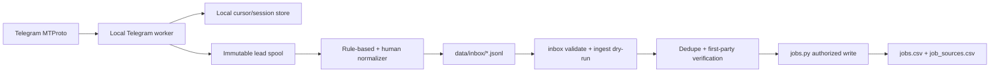
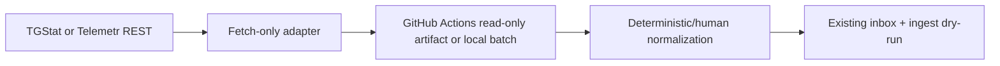

# Подключение Telegram-источников к job tracker

> Historical record. Not a contract.

Статус: исследование и предложение архитектуры, не реализовано  
Проверено: 2026-08-20

## Короткий вывод

Получать сообщения из каналов, на которые подписан обычный Telegram-аккаунт,
технически можно. Для этого нужен не Bot API, а клиентский Telegram API поверх
MTProto: приложение авторизуется номером телефона, получает обычную пользовательскую
сессию, видит доступные этому аккаунту диалоги и может читать историю каналов.
Официальные методы [`messages.getDialogs`](https://core.telegram.org/method/messages.getDialogs)
и [`messages.getHistory`](https://core.telegram.org/method/messages.getHistory)
прямо описывают эти возможности; `getHistory` доступен только пользователям, не
ботам.

Для этого репозитория лучший основной вариант — небольшой локальный Python-адаптер
на Telethon, работающий только с явным allowlist каналов. Его следует запускать
на личном Mac или другом доверенном постоянно включённом устройстве. Telegram-сессия
не должна попадать в Git, GitHub Actions или обычный VPS без отдельной защиты.

Рекомендуется гибрид из трёх контуров:

1. **Локальный MTProto-адаптер** — для выбранных публичных и приватных каналов,
   доступных пользовательскому аккаунту.
2. **Collector-бот с ручной пересылкой** — самый простой и безопасный MVP для
   единичных важных сообщений.
3. **TGStat/Telemetr API** — дополнительный поиск по публичному Telegram за
   пределами текущих подписок без доступа к личному аккаунту.

Bot API, n8n, Make, Zapier и Pipedream подходят только когда бот уже получает
сообщение: например, бот добавлен в собственный канал или пользователь вручную
переслал пост боту. Они не дают боту доступ к ленте каналов личного аккаунта.

Отдельное существенное ограничение: актуальные
[Telegram API Terms](https://core.telegram.org/api/terms) и
[Terms of Service for Content Licensing](https://telegram.org/tos/content-licensing)
запрещают использовать или агрегировать данные Telegram для обучения,
улучшения либо развёртывания AI/ML-систем. Поэтому автоматический pipeline не
должен отправлять сырой текст Telegram-постов в LLM. Безопасная граница для
этого проекта — локальные детерминированные фильтры и извлечение ссылок, после
чего обычный анализ проводится уже по внешней first-party странице работодателя.
Это не юридическое заключение; перед более широким или коммерческим сбором
данных условия следует проверить отдельно.

## Что важно в контексте текущего трекера

Текущий поток данных уже хорошо подходит для нового discovery-источника:

```text
source -> read-only/raw layer -> dedupe -> first-party verification
       -> jobs.py -> jobs.csv + job_sources.csv -> generated tracker
```

Но произвольное сообщение Telegram нельзя сразу записать в существующий
`data/inbox/*.jsonl`. Текущий контракт уже требует непустые `company`, `role`,
`source_job_id`, `source_url` и `application_url`. В Telegram-посте:

- компания или роль могут отсутствовать или быть неоднозначны;
- один пост может содержать несколько вакансий;
- Apply может быть ссылкой, email, Telegram-контактом или отсутствовать;
- пост может быть репостом, а не оригинальной публикацией;
- удаление поста не доказывает закрытие вакансии у работодателя.

Поэтому Telegram нужен двухступенчатый вход:

1. **Telegram lead spool** — локальная временная очередь сообщений и ссылок,
   ещё не совместимая с canonical inbox.
2. **Normalizer** — детерминированно или с ручным подтверждением выделяет
   конкретные вакансии и только затем создаёт валидный immutable JSONL для
   существующего `jobs.py ingest`.

Это сохраняет главный инвариант репозитория: в structured data не появляются
выдуманные компания, роль или Apply URL.

Также текущий enum содержит `Find My Remote / Telegram`, но это не подходящее
общее имя для постов из произвольных каналов. До реализации разумно добавить
отдельный `source=Telegram`, а существующее значение оставить для legacy-записей
конкретного источника. Название канала, его numeric peer ID и username нужно
хранить в provenance/payload, а не превращать каждый канал в новый enum.

## Матрица вариантов

| Способ | Каналы личного аккаунта | Приватные каналы | История | Live updates | Сложность | Итог |
|---|---:|---:|---:|---:|---:|---|
| MTProto user client | да | да, если аккаунт участник | да | да | средняя | основной вариант |
| Официальный TDLib | да | да | да | да | высокая | надёжно, но избыточно для MVP |
| Bot API в канале | нет общей ленты | только где бот добавлен | нет общего backfill | да | низкая | только свои/партнёрские каналы |
| Collector-бот + ручной forward | только выбранные человеком посты | если forward разрешён | нет | по факту forward | низкая | лучший быстрый MVP |
| Telegram Desktop export / takeout | да | да | да | нет | низкая/средняя | разовый backfill и аудит |
| `t.me/s` + RSS bridge | только публичные | нет | небольшой публичный срез | polling | низкая | резервный вариант для нескольких каналов |
| TGStat / Telemetr | публичный индекс сервиса | нет | да, в пределах тарифа/индекса | polling/callback | низкая/средняя | лучший широкий public discovery |
| n8n/Make/Zapier/Pipedream | только то, что видит бот | только где есть бот | обычно нет | да | низкая | оркестратор, не способ получить подписки |
| Browser automation Telegram Web | потенциально да | потенциально да | хрупко | хрупко | высокая | не использовать как production source |
| Чтение/конвертация `tdata` | технически да | да | зависит от сессии | да | высокая и рискованная | не использовать |

## Вариант 1. MTProto от имени обычного пользователя

### Что даёт

Telegram разделяет Bot API и клиентский Telegram API. Пользовательский клиент:

- авторизуется номером телефона, кодом и, при наличии, 2FA;
- получает список диалогов и папок аккаунта;
- читает историю доступных каналов и супергрупп;
- получает новые, изменённые и удалённые сообщения через updates;
- может работать с публичными и приватными каналами, если аккаунт имеет доступ;
- может восстановить пропуски через историю и update state.

[Документация по updates](https://core.telegram.org/api/updates) указывает,
что ID сообщения уникален внутри канала, а устойчивый ключ сообщения — пара
`channel/peer ID + message ID`. Это естественный исходный ключ для дедупликации.

Перед первым входом нужно создать собственное Telegram application на
[`my.telegram.org`](https://my.telegram.org) и получить `api_id`/`api_hash`.
Telegram предупреждает, что сторонние клиенты контролируются на злоупотребления,
а flooding/spam может привести к блокировке; это описано в инструкции
[Creating your Telegram Application](https://core.telegram.org/api/obtaining_api_id).

### Важная граница доступа

У пользовательской MTProto-сессии нет OAuth-подобного scope «только эти пять
каналов». Авторизационный ключ действует с identity пользователя; официальная
[документация авторизации](https://core.telegram.org/api/auth) говорит, что
последующие API-вызовы выполняются от имени этого пользователя.

Allowlist в нашем коде ограничит фактическое чтение, но не возможности украденной
сессии. Поэтому:

- если все нужные каналы публичные, предпочтителен отдельный Telegram-аккаунт,
  подписанный только на job-каналы;
- если нужны приватные каналы текущего аккаунта, worker лучше держать локально;
- 2FA защищает новый login, но не спасает от кражи уже авторизованной session;
- утечка session-файла эквивалентна утечке активного входа. Документация
  [Telethon Sessions](https://docs.telethon.dev/en/v2/concepts/sessions.html)
  прямо предупреждает, что владелец session-файла может войти в аккаунт.

### История, live и восстановление

Есть два разумных режима.

**Периодический pull** — раз в 15–60 минут запрашивать сообщения с ID больше
локального cursor. Он проще, хорошо сочетается с текущими batch-адаптерами и не
требует постоянно работающего процесса.

**Постоянный worker** — держать MTProto-соединение и обрабатывать `NewMessage`,
`MessageEdited`, `MessageDeleted`. Он быстрее, но требует daemon supervision и
reconciliation после downtime.

Для job tracker оптимален комбинированный режим: live или частый pull плюс один
раз в сутки bounded backfill последних 2–7 дней. Это ловит пропуски, редактирования
и ошибки локального cursor без массового чтения всей истории.

### Глобальный поиск, не только подписки

Telegram также добавил официальный метод
[`channels.searchPosts`](https://core.telegram.org/api/search), который ищет
текст во всех публичных каналах, даже если аккаунт на них не подписан. Это
полезный дополнительный источник вакансий, но не замена подпискам:

- полнотекстовые поиски имеют free quota и могут требовать Telegram Stars;
- перед поиском нужно проверять лимит через `channels.checkSearchPostsFlood`;
- официальная документация требует, чтобы такой поиск инициировал пользователь,
  а не бесконтрольный realtime crawler;
- приватные каналы этим способом недоступны.

Для трекера это должен быть отдельный ручной CLI pass: пользователь запускает
конкретный query, подтверждает возможное списание Stars, результаты попадают в
тот же lead spool. Не следует ставить global search на cron.

### Библиотеки

| Библиотека | Состояние на дату проверки | Плюсы | Минусы | Вывод |
|---|---|---|---|---|
| [Telethon](https://codeberg.org/Lonami/Telethon) | GitHub архивирован после переезда на Codeberg; репозиторий Codeberg активен, свежий commit был 2026-08-19 | Python, удобные history iterators и events, близок стеку текущего repo | session SQLite по умолчанию не является отдельным secret vault; нужно аккуратно pin/upgrade | лучший fit |
| [TDLib](https://github.com/tdlib/td) | официальный активный проект Telegram | порядок updates, reconnect, local message DB, шифрование БД | C++ build/native dependency, больше operational surface | для более тяжёлого production-варианта |
| [gotd/td](https://github.com/gotd/td) | активный Go MTProto client | тесты, session storage, rate limiting, reconnect | отдельный Go service ради небольшого источника | сильный запасной вариант |
| [Hydrogram](https://github.com/hydrogram/hydrogram) | community fork Pyrogram | знакомый Pyrogram-style API, Python | меньше ecosystem и release cadence, чем у Telethon | только после отдельного аудита |
| [Pyrogram](https://github.com/pyrogram/pyrogram) | архивирован 2024-12-23, больше не поддерживается | простой API | нет upstream maintenance | не начинать новый код |
| [GramJS](https://github.com/gram-js/gramjs) | архивирован 2026-07-14 | TypeScript/Node | archived; не соответствует Python-коду repo | не выбирать |
| [MadelineProto](https://github.com/danog/MadelineProto) | активный PHP MTProto client | зрелый и функциональный | PHP runtime и AGPL, не нужен текущему проекту | не подходит по стеку |

### Приблизительная инфраструктура



Компоненты:

- `scripts/import_telegram.py` или отдельный `scripts/telegram_worker.py`;
- Telethon, зафиксированный по версии/hash;
- session и cursor вне Git checkout, в защищённом локальном application-data
  каталоге с правами владельца;
- launchd на macOS для pull каждые 30 минут либо daemon supervision;
- source allowlist по numeric peer ID, а не только изменяемому username;
- локальный immutable spool; в Git остаются только нормализованные provenance
  и canonical job facts;
- никакого публичного webhook и входящего порта не требуется.

Инфраструктурная стоимость при локальном запуске практически нулевая. MVP
адаптера — ориентировочно 2–4 инженерных дня; надёжный reconciliation,
edit/delete handling, fixtures и документация — ещё 3–5 дней.

### Вердикт

Это единственный прямой вариант, который полностью отвечает примеру «мой
профиль и каналы, на которые я подписан». Для этого repo он подходит лучше всего,
если строго ограничить каналы, объём, хранение и не использовать Telegram-текст
как вход LLM.

## Вариант 2. Bot API

### Что бот действительно видит

Bot API принимает `channel_post` и `edited_channel_post`. По
[Bot FAQ](https://core.telegram.org/bots/faq) бот получает сообщения из каналов,
где он является участником. На практике это требует, чтобы владелец/администратор
добавил бота в канал; бот не наследует подписки создавшего его человека.

У Bot API есть два delivery-режима:

- `getUpdates` long polling;
- HTTPS webhook.

[Bot API](https://core.telegram.org/bots/api) хранит неполученные updates не
дольше 24 часов. Bot API не даёт обычного `messages.getHistory`; исторический
backfill произвольного канала недоступен.

### Где способ подходит

1. Пользователь владеет каналом или администратор согласен добавить collector bot.
2. Есть приватный служебный канал, куда другие automation пересылают leads.
3. Пользователь вручную пересылает интересный пост в личный чат с ботом.

### Collector-бот с ручным forward

Это отдельный, очень практичный вариант. Пользователь читает Telegram как
обычно и пересылает подходящие посты в личный чат с ботом. Worker получает только
сознательно выбранные сообщения, извлекает source metadata и URLs и кладёт lead
в очередь.

Плюсы:

- session личного аккаунта нигде не хранится;
- нет доступа к контактам и другим чатам;
- минимум ToS/privacy blast radius;
- не нужен список каналов и reconciliation;
- можно сразу добавить кнопки `ignore`, `normalize`, `duplicate` как будущий UX.

Минусы:

- discovery остаётся ручным;
- protected content нельзя пересылать;
- origin может быть скрыт, тогда нужен вручную добавленный URL;
- массовый backfill неудобен.

Для начала это лучший способ проверить качество Telegram-источников до создания
полноценного user client.

### Инфраструктура

Для небольшого локального проекта проще polling:

```text
BotFather token -> local getUpdates worker -> local offset state
                 -> lead spool -> manual normalize -> existing inbox
```

Webhook нужен только если worker размещён в сервисе с публичным HTTPS. Тогда
можно использовать n8n/Pipedream/Make, но это добавляет третьей стороне текст
пересланных постов. Для приватных или чувствительных источников предпочтительнее
локальный polling.

Оценка MVP: 0.5–1.5 дня.

### Вердикт

Не решает автоматическое чтение подписок, но превосходен как pilot и manual
inbox. Также это правильный вариант для собственных каналов.

## Вариант 3. Официальный TDLib

[TDLib](https://core.telegram.org/tdlib/getting-started) — официальный
полноценный Telegram client library. Он берёт на себя сеть, шифрование, порядок
updates, reconnect и локальную базу сообщений. Можно включить
`use_message_database`, получить списки чатов и читать историю через
`getChatHistory`.

Плюсы по сравнению с высокоуровневой Python-библиотекой:

- официальный Telegram project;
- надёжная update state machine;
- локальный cache/history database;
- шифрование локальной БД пользовательским ключом;
- хорошо подходит для постоянно работающего multi-account service.

Минусы:

- сборка C++ и native dependencies;
- асинхронный JSON/C API заметно многословнее;
- нужно управлять версией binary и bindings;
- для десятков job-каналов это слишком тяжёлый runtime.

### Инфраструктура

```text
TDLib service/container -> encrypted persistent volume
                        -> normalized lead queue
                        -> current inbox/ingest pipeline
```

Использовать только при переходе от личного трекера к постоянно работающему
сервису, при нескольких аккаунтах или при проблемах с update consistency.
Оценка MVP — примерно 1–2 недели.

### Вердикт

Технически очень качественно, но не первый выбор. Telethon даёт нужный результат
быстрее и лучше соответствует текущему Python repo.

## Вариант 4. Telegram Desktop export и Takeout API

Официальный Telegram Desktop умеет экспортировать отдельный chat или весь
аккаунт в JSON/HTML: [официальное описание](https://telegram.org/blog/export-and-more).
У Telegram также есть отдельный
[Takeout API](https://core.telegram.org/api/takeout), где можно явно включить
`message_channels` и постранично выгрузить диалоги и историю.

Плюсы:

- официальный путь;
- хорош для initial backfill и разового исследования каналов;
- JSON можно обработать локально;
- не нужен постоянно работающий client.

Минусы:

- это snapshot, не live source;
- экспорт всего аккаунта создаёт большой чувствительный архив;
- JSON schema ориентирована на export, а не на incremental ingestion;
- повторные выгрузки сложнее дедуплицировать и автоматизировать;
- актуальные issue Telegram Desktop показывают, что фильтры и отдельные виды
  чатов иногда имеют platform-specific bugs.

### Подходящая инфраструктура

```text
Telegram Desktop JSON export
 -> local one-shot parser
 -> rule-based URL/keyword extraction
 -> manual selection
 -> existing inbox JSONL
```

Экспорт нужно хранить вне репозитория и удалить после завершения нормализации,
если он больше не нужен. Media для job discovery лучше вообще не выгружать.

### Вердикт

Хороший разовый backfill или способ оценить signal-to-noise до разработки API,
но не постоянный источник.

## Вариант 5. Публичные страницы `t.me/s` и RSS

Для публичных каналов Telegram рендерит web preview вида
`https://t.me/s/<channel>`. Проверка через Browser подтвердила, что страница
показывает текст и permalink сообщений без входа. Готовые проекты превращают
этот preview в feeds:

- [RSS-Bridge TelegramBridge](https://rss-bridge.github.io/rss-bridge/Bridge_Specific/Telegram.html)
  по умолчанию получает одну страницу, до 20 сообщений; глубину можно увеличить
  через `max_pages`;
- [RSSHub](https://github.com/DIYgod/RSSHub) — крупный self-hosted RSS framework
  с Telegram routes;
- простые one-off scrapers могут читать ту же публичную HTML-страницу.

Плюсы:

- не нужны телефон, `api_id`, `api_hash` или session;
- легко self-host;
- feed удобно polling-ить обычным HTTP adapter;
- минимальный риск компрометации аккаунта.

Минусы:

- только публичные каналы с username;
- выдаётся ограниченный срез истории;
- HTML и media URLs могут меняться;
- edit/delete detection слабее MTProto;
- это scraping surface, а не обещанный стабильный API;
- массовый сбор создаёт ToS/licensing риск.

### Инфраструктура

```text
RSS-Bridge container -> scheduled feed fetch -> local dedupe
                     -> lead spool -> normalizer -> inbox
```

Для 5–20 заранее известных публичных job-каналов можно запускать RSS-Bridge
локально или вовсе обращаться к `t.me/s` ограниченным polling. Публичный shared
RSS host хуже: он узнаёт список отслеживаемых каналов и может логировать запросы.

### Вердикт

Хороший fallback, если личная MTProto-сессия неприемлема и каналы публичные.
Не стоит строить на нём основной долговечный adapter.

## Вариант 6. Сторонние индексы и API

### TGStat

[TGStat API](https://api.tgstat.ru/docs/) предлагает:

- поиск публикаций по ключевым словам;
- фильтры по date, language, country, category и channel/chat;
- историю постов известных каналов;
- Callback API для новых/изменённых/удалённых публикаций и keyword mentions.

Метод [`posts/search`](https://api.tgstat.ru/docs/ru/posts/search.html)
возвращает посты в обратном хронологическом порядке, имеет pagination и
расширенный query syntax. Callback API умеет подписываться на канал либо фразу,
но требует принадлежащий пользователю публичный webhook endpoint.

Плюсы:

- широкий поиск за пределами подписок;
- нет Telegram user session;
- обычный REST/JSON;
- хорошо подходит к существующему fetch-only pattern Himalayas.

Минусы:

- только то, что индексирует сервис;
- приватные каналы недоступны;
- API поиска и чужие каналы платные/квотируемые;
- TGStat становится дополнительной trust/availability boundary;
- пост всё равно остаётся discovery evidence, не first-party verification.

### Telemetr

[Telemetr.io Public API](https://api.telemetr.io/swagger-ui/) предоставляет
channel messages, channel search, statistics и alpha message search с фильтрами.
Это похожий вариант с другими coverage и тарифами. Для фиксированного списка
каналов нужно сравнить фактическую полноту обоих сервисов на недельном pilot.

### Hosted scrapers / Apify Actors

В магазинах managed scrapers есть Telegram Channel Scraper actors. Их плюс —
готовый REST и scheduling. Но конкретный actor является third-party code, часто
не имеет устойчивого SLA, может неожиданно потребовать session/cookies и несёт
дополнительный supply-chain/privacy риск. Для job tracker такой слой слабее
TGStat/Telemetr и локального adapter. Не рекомендуется передавать hosted actor
пользовательскую Telegram session.

### Инфраструктура

Для polling API можно переиспользовать существующий read-only workflow:



API token можно хранить в GitHub Actions secret, потому что он не является
Telegram account session. Workflow должен оставаться read-only и публиковать
только временный artifact, как текущий Himalayas discovery.

Для Callback нужен маленький публичный receiver и durable queue. Это имеет смысл
только при действительно realtime требованиях; для поиска работы polling раз в
1–6 часов проще и дешевле.

Оценка интеграции одного REST API: 1–3 дня плюс время на доступ/тариф и pilot.

### Вердикт

Лучший широкий public discovery и сильное дополнение к персональному allowlist.
Не решает приватные каналы и не заменяет first-party verification.

## Вариант 7. n8n, Make, Zapier и Pipedream

Официальный [n8n Telegram Trigger](https://github.com/n8n-io/n8n/blob/master/packages/nodes-base/nodes/Telegram/TelegramTrigger.node.ts)
поддерживает `channel_post`, но его credential — Bot API token. Аналогично:

- [Zapier Telegram](https://help.zapier.com/hc/en-us/articles/16700016131085-How-to-get-started-with-Telegram-on-Zapier)
  запускается, когда сообщение получил bot;
- Make `Watch Updates` использует Telegram Bot token/webhook;
- [Pipedream Channel Updates](https://pipedream.com/integrations/update-role-with-peerdom-api-on-new-channel-updates-instant-from-telegram-api-int_3xsE1Mv9)
  фильтрует Bot API events `channel_post`/`edited_channel_post`.

Это хорошие workflow engines после получения event, но не способ читать
каналы пользователя.

Существуют community MTProto nodes:

- [n8n-nodes-telegram-client](https://github.com/ofekb/n8n-nodes-telegram-client);
- [n8n-nodes-telegram-mtproto](https://github.com/veezex/n8n-nodes-telegram-mtproto).

Они хранят user session/string credential внутри n8n. У таких packages небольшой
trust footprint; компрометация community node или n8n instance даёт доступ ко
всей Telegram-сессии. Для личного аккаунта это хуже небольшого аудируемого
локального Python adapter.

### Когда no-code оправдан

- собственный канал и Bot API;
- collector-бот;
- TGStat Callback receiver;
- enrichment внешних first-party URLs после Telegram boundary;
- уведомления о новых leads.

### Вердикт

Использовать как оркестратор вокруг Bot API/REST, но не помещать туда личную
MTProto-сессию без отдельного security review.

## Готовые open-source решения на GitHub

Ни один найденный проект нельзя бездумно подключить к canonical CSV. Полезнее
использовать их как reference implementation отдельных частей.

| Проект | Что готово | Что можно взять | Почему не ставить целиком |
|---|---|---|---|
| [DCT](https://github.com/dfwdfq/DCT) | список подписанных каналов, полный dump, JSONL, media | backfill UX и Telegram message projection | маленький проект; export schema не соответствует tracker inbox |
| [TGMonitor](https://github.com/jar0x0/TGMonitor) | multi-account Telethon listener, allowlist, keywords, Redis/MySQL, dedupe | идеи cursor/dedupe/keyword layers | Redis+MySQL+PM2 избыточны; мало истории проекта |
| [tg-watchbot](https://github.com/GongyiChuren/tg-watchbot) | Docker, Web UI, QR login, user session, keyword monitor | QR onboarding и operator UX | большой монолит с unrelated bot/RSS/admin функциями |
| [Televizor](https://github.com/s0larpunk/televizor) | Telethon feed worker, filters, Postgres/Redis, session encryption | album debounce, filter/rate-limit patterns | это feed-forwarding SaaS/full stack, не job adapter |
| [RSS-Bridge](https://github.com/RSS-Bridge/rss-bridge) | стабильный TelegramBridge для public preview | public-channel fallback | нет private/history полноты, polling HTML |
| [RSSHub](https://github.com/DIYgod/RSSHub) | mature RSS framework, Docker | если RSSHub уже развёрнут | слишком большой dependency ради одной route |
| [n8n MTProto nodes](https://github.com/ofekb/n8n-nodes-telegram-client) | готовая user auth/session внутри n8n | быстрый disposable prototype | session supply-chain risk и слабая изоляция scope |
| [opentele/opentele2](https://opentele2.github.io/) | конвертация Telegram Desktop `tdata` в Telethon session | recovery/migration research | работа с bearer session material, не нужна для нормальной авторизации |

Перед заимствованием кода нужны обычные проверки: license compatibility,
dependency audit, pinning по commit, просмотр session handling и отсутствие
outbound telemetry. Число stars не заменяет этот аудит.

## Варианты, которые лучше исключить

### Authenticated Telegram Web automation

Управлять Telegram Web через browser/Playwright возможно, но это плохой data
source:

- DOM и virtual scrolling нестабильны;
- история догружается UI-событиями;
- трудно гарантировать полноту и cursor;
- браузерный профиль получает доступ ко всему аккаунту;
- CAPTCHA/login/QR flow мешают headless run;
- source identity извлекается хуже, чем из API.

Browser остаётся полезен для ручной проверки ссылки на конкретный публичный пост,
но не для production ingestion.

### Прямое чтение или конвертация `tdata`

Проекты вроде opentele могут превратить Telegram Desktop `tdata` в Telethon
session. Это технически интересно, но обходится без отдельного clean login и
работает с наиболее чувствительным credential material. Нормальный путь — создать
собственный `api_id`, выполнить отдельный QR/phone login и получить отдельную
revocable session. `tdata` нельзя копировать на сервер или помещать в backup
репозитория.

### User session в GitHub Actions

Ephemeral CI плохо подходит для активной MTProto-сессии:

- session string является bearer credential;
- runner IP/device постоянно меняются;
- concurrent runs могут повредить update state;
- secret попадает в большую trust boundary;
- CI polling создаёт много повторных login/connection patterns.

GitHub Actions уместен для TGStat/Telemetr REST token или public RSS, но не для
личной Telegram session.

### LLM-классификация сырого Telegram content

Даже если технически легко отправить пост в OpenAI/Anthropic/local LLM и попросить
выделить `company`/`role`, актуальные Telegram terms делают это рискованным.
Рекомендуемая обработка:

- keyword/regex filters;
- URL и email extraction;
- HTML entity parsing;
- ручное подтверждение неоднозначных полей;
- последующий AI-анализ только first-party страницы вне Telegram.

Сырой текст приватных каналов и media нельзя коммитить в Git. Для provenance
достаточно exact message identity, permalink при наличии, короткого factual note
и внешних URLs.

## Рекомендуемая целевая архитектура

### Контур A — локальный subscribed-channel adapter

**Где работает:** Mac пользователя через launchd.  
**Аккаунт:** отдельный job-search account для публичных каналов; основной account
только если нужны private subscriptions.  
**Протокол:** Telethon/MTProto.  
**Cadence:** 30 минут плюс daily reconciliation за 7 дней.  
**Scope:** только numeric peer IDs из локального allowlist.  
**Writes:** только immutable local lead spool; никаких canonical writes.

Состояние:

```json
{
  "schema_version": 1,
  "peers": {
    "-1001234567890": {
      "last_message_id": 4321,
      "last_reconciled_at": "2026-08-20T08:00:00Z"
    }
  }
}
```

Состояние обновляется только после успешной атомарной записи lead batch. При
crash допустим повторный fetch: downstream dedupe по message identity безопаснее,
чем потерянное сообщение.

### Контур B — ручной collector bot

**Где работает:** тот же локальный process или маленький self-hosted worker.  
**Delivery:** `getUpdates`, чтобы не открывать публичный endpoint.  
**Назначение:** private/protected/редкие leads и быстрый pilot.  
**Storage:** та же lead spool schema.

### Контур C — широкий public search

**Источник:** TGStat Search API, запасной вариант Telemetr.  
**Где работает:** existing read-only source-discovery workflow или локально.  
**Cadence:** 1–6 часов для narrow queries, daily broad pass.  
**Output:** temporary artifact, не canonical CSV.  
**Secrets:** только provider API token.

### Общий normalizer

Normalizer показывает человеку новые лиды и выполняет:

1. проверку, что message ещё не известен;
2. выделение каждой отдельной вакансии внутри поста;
3. извлечение outbound URLs и contact routes;
4. подтверждение `company` и `role`;
5. создание record, совместимого с `data/inbox/README.md`;
6. запуск `inbox.py validate` и обязательного `jobs.py ingest --dry-run`;
7. дальнейшую first-party verification по общему source lifecycle.

## Предлагаемая identity и projection

### Message identity

Базовый стабильный ключ:

```text
telegram:<numeric_peer_id>:<message_id>
```

Публичный URL:

```text
https://t.me/<username>/<message_id>
```

Для private channel Telegram может дать `t.me/c/...` link, доступный только
участнику. Numeric peer ID остаётся основным identity; username и title могут
измениться.

### Несколько вакансий в одном сообщении

Один `peer_id:message_id` описывает source message, а не всегда одну vacancy.
После ручного split каждой вакансии нужен стабильный suffix:

```text
<peer_id>:<message_id>:<hash(exact outbound URL)>
```

Если exact URL нет:

```text
<peer_id>:<message_id>:<hash(normalized company + role)>
```

Нельзя использовать порядковый индекс `:1`, `:2`: edit поста может изменить
порядок и сломать identity.

### Поля lead spool

Минимальный локальный record:

```json
{
  "schema_version": 1,
  "peer_id": "-1001234567890",
  "message_id": 4321,
  "channel_title": "Frontend Jobs",
  "channel_username": "frontend_jobs",
  "message_url": "https://t.me/frontend_jobs/4321",
  "posted_at_utc": "2026-08-20T07:42:13Z",
  "edited_at_utc": null,
  "text": "local-only raw text",
  "outbound_urls": ["https://company.example/jobs/123"],
  "matched_terms": ["frontend", "react"],
  "forwarded_from": null
}
```

`text` остаётся только в локальной ignored queue и удаляется по retention policy.
В canonical provenance не переносится полный текст.

### Projection в текущий inbox

После подтверждения одной конкретной вакансии:

| Inbox field | Telegram rule |
|---|---|
| `source` | новое значение `Telegram` |
| `source_job_id` | composite candidate identity |
| `company` | подтверждённое человеком/first-party значение |
| `role` | одна конкретная роль |
| `source_url` | exact Telegram post permalink |
| `application_url` | лучший outbound job/apply URL; если URL нет, post URL как unverified contact route с payload marker |
| `posted_at` | UTC calendar date message; полный timestamp остаётся в payload |
| `raw_location` | только явно указанная строка, иначе `Unknown` |
| `found_at` | business date `Europe/Belgrade` |
| `payload.telegram` | peer/message IDs, channel metadata, outbound URLs, edit/forward markers; без ненужного private text |

Telegram URL никогда не ставится в `original_url` автоматически. Даже если
пост свежий, `listing_status`, `first_party_verified` и `apply_verified` остаются
`unknown` до проверки работодателя/ATS.

### Edits, deletes и reposts

- `MessageEdited` обновляет source-side evidence, но не canonical listing status.
- `MessageDeleted` означает только удаление discovery post; вакансия может быть
  открыта на ATS.
- forwarded post должен хранить и текущий discovery permalink, и original
  forward origin, если Telegram его раскрывает.
- одинаковый outbound requisition из нескольких каналов становится несколькими
  source references одной canonical job.

## Security checklist

- Создать собственный `api_id`/`api_hash`; не использовать credentials из
  примеров или Telegram Desktop.
- Включить 2FA и device passcode, но считать session самостоятельным bearer
  secret.
- Session, `api_hash`, phone и private channel list не хранить в repo.
- Права session/state files — только owner; на Mac полагаться как минимум на
  FileVault и защищённый application-data directory.
- Не логировать login codes, 2FA password, session string или raw private posts.
- Не хранить media в MVP.
- Не отправлять сообщения, не вступать автоматически в каналы, не накручивать
  views, не менять read state.
- Ограничить запросы allowlist и bounded age window; корректно уважать
  `FLOOD_WAIT` без агрессивных retries.
- Сделать kill switch и документировать отзыв session через Telegram Settings →
  Devices.
- Pin dependency version/commit и проверять changelog Telegram layer.
- Raw lead retention сделать коротким, например 30 дней или до нормализации.
- Сырые данные private channels не отправлять в cloud logs, LLM или public
  artifacts.

## Предлагаемый порядок реализации

### Phase 0 — pilot без пользовательской session

1. Создать collector bot.
2. За неделю вручную пересылать посты из 5–10 наиболее полезных каналов.
3. Измерить: leads/week, долю дублей, долю постов без first-party URL, долю
   подходящих вакансий.
4. Зафиксировать реальный Telegram lead schema и edge cases.

Результат: понятно, оправдан ли доступ ко всем подпискам.

### Phase 1 — локальный MTProto pull adapter

1. Добавить `Telegram` в source enum и `config/sources.toml`.
2. Реализовать one-time login и локальное хранение session.
3. Реализовать `list-dialogs` и создание numeric allowlist.
4. Реализовать bounded history pull, cursor и immutable lead spool.
5. Добавить keyword/URL filters без ML.
6. Добавить normalizer в existing inbox contract.
7. Добавить tests на identity, multi-role, edits, reposts и crash recovery.
8. Создать `docs/sources/telegram.md` playbook только после реальной валидации.

### Phase 2 — reconciliation и collector UX

1. Daily backfill.
2. Edit/delete events.
3. Retention cleanup.
4. Команды collector bot для просмотра/отклонения лидов.
5. Метрики source yield без сохранения лишнего текста.

### Phase 3 — широкий public discovery

1. Недельный A/B pilot TGStat и Telemetr на одних queries.
2. Выбрать provider по coverage/duplicate rate/cost.
3. Добавить fetch-only adapter и read-only artifact workflow.
4. Оставить `channels.searchPosts` ручным дополнительным pass.

## Итоговая рекомендация

Практический порядок для этого личного трекера:

1. **Сейчас:** collector bot с ручной пересылкой. Это быстро проверит полезность
   каналов без риска для аккаунта.
2. **После pilot:** локальный Telethon pull adapter, предпочтительно на отдельном
   job-search account. Основной account использовать только для приватных каналов,
   которые нельзя перенести.
3. **Параллельно:** TGStat Search API как широкий публичный поиск по ключевым
   словам и новые каналы за пределами подписок.
4. **Не делать:** LLM-анализ сырого Telegram content, session в GitHub Actions,
   browser scraping авторизованного Telegram Web и конвертацию `tdata`.

Такой гибрид даёт полноту личных подписок, дешёвый ручной fallback и расширение
по всему публичному Telegram, не ломая текущую trust boundary трекера.

## Основные источники

### Telegram

- [Обзор Telegram APIs](https://core.telegram.org/)
- [Создание Telegram application и получение api_id](https://core.telegram.org/api/obtaining_api_id)
- [User authorization](https://core.telegram.org/api/auth)
- [messages.getDialogs](https://core.telegram.org/method/messages.getDialogs)
- [messages.getHistory](https://core.telegram.org/method/messages.getHistory)
- [Working with Updates](https://core.telegram.org/api/updates)
- [Search and channels.searchPosts](https://core.telegram.org/api/search)
- [Bot API](https://core.telegram.org/bots/api)
- [Bots FAQ](https://core.telegram.org/bots/faq)
- [TDLib getting started](https://core.telegram.org/tdlib/getting-started)
- [Takeout API](https://core.telegram.org/api/takeout)
- [Telegram API Terms](https://core.telegram.org/api/terms)
- [Terms of Service for Content Licensing](https://telegram.org/tos/content-licensing)
- [Bot Platform Developer Terms](https://telegram.org/tos/bot-developers)

### Libraries and projects

- [Telethon on Codeberg](https://codeberg.org/Lonami/Telethon)
- [TDLib](https://github.com/tdlib/td)
- [gotd/td](https://github.com/gotd/td)
- [RSS-Bridge](https://github.com/RSS-Bridge/rss-bridge)
- [RSSHub](https://github.com/DIYgod/RSSHub)
- [TGMonitor](https://github.com/jar0x0/TGMonitor)
- [tg-watchbot](https://github.com/GongyiChuren/tg-watchbot)
- [Televizor](https://github.com/s0larpunk/televizor)
- [DCT](https://github.com/dfwdfq/DCT)

### External APIs

- [TGStat API](https://api.tgstat.ru/docs/)
- [TGStat posts/search](https://api.tgstat.ru/docs/ru/posts/search.html)
- [TGStat Callback API](https://api.tgstat.ru/docs/ru/callback/intro.html)
- [Telemetr.io Public API](https://api.telemetr.io/swagger-ui/)
