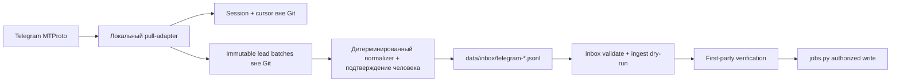

# План реализации Telegram-источника

Статус: первая поставка реализована и проверена — 2026-08-21  
Основание: [`telegram-source-integration-analysis.md`](telegram-source-integration-analysis.md)  
Цель первой поставки: локальный безопасный discovery-поток от Telegram до
валидного `data/inbox/*.jsonl`, без прямой записи в canonical CSV и без передачи
сырого текста Telegram в LLM или облачные сервисы.

Итоговая проверка: 41 Telegram domain/adapter/integration tests и 163 теста
полного repository suite прошли; strict dataset validation и generated tracker
check прошли; реальный login намеренно оставлен ручной внешней контрольной
точкой.

## 1. Результат первой поставки

После реализации пользователь сможет:

1. создать отдельную локальную Telegram-сессию через официальный `api_id` и
   `api_hash`;
2. получить список доступных каналов и выбрать numeric peer IDs в локальный
   allowlist;
3. выполнить ограниченный pull выбранных каналов за заданное число дней;
4. получить immutable локальный batch лидов с устойчивой identity
   `telegram:<peer_id>:<message_id>`;
5. повторить pull без потери сообщений и без повторной записи уже известного
   сообщения;
6. вручную подтвердить `company`, `role`, `application_url` и location для одной
   конкретной вакансии;
7. спроецировать подтверждённую вакансию в существующий immutable raw inbox;
8. выполнить штатные `inbox.py validate` и `jobs.py ingest --dry-run`;
9. продолжить обычный first-party verification lifecycle трекера.

Первая поставка не отправляет заявки, не меняяет `application_status` на
`applied`, не пишет напрямую в `jobs.csv`/`job_sources.csv`, не читает каналы вне
allowlist, не загружает media и не делает AI-классификацию текста сообщений.

## 2. Архитектурные границы



### Trust boundary

- Telegram session, `api_hash`, телефон, allowlist и сырой текст находятся
  только в локальном application-data каталоге.
- В Git допускаются код, обезличенные fixtures, source policy и playbook.
- Raw inbox может содержать только подтверждённые человеком vacancy facts и
  минимальную Telegram provenance без полного текста поста.
- Telegram post остаётся discovery evidence. Он не подтверждает, что вакансия
  открыта, доступна кандидату или имеет рабочую Apply route.
- Любая неоднозначность `company`/`role` останавливает normalizer и требует
  явных значений пользователя; значения не выводятся автоматически из текста.

## 3. Зафиксированные технические решения

### 3.1 Runtime и dependency

- Python, чтобы соответствовать текущему репозиторию.
- Telethon загружается лениво только Telegram-командами: обычные тесты и CLI
  трекера не должны требовать установленный пакет.
- Версия Telethon фиксируется в отдельном requirements-файле внутри подкаталога,
  а не новым файлом в корне.
- Сетевой код отделён от pure projection/storage функций и тестируется через
  fake client/messages без реального Telegram.

### 3.2 Локальные пути

- Production default: защищённый каталог пользователя вне checkout.
- Для тестов и отладки путь задаётся явным CLI-флагом или специальной переменной
  `JOB_TRACKER_TELEGRAM_DIR`.
- Session, state и lead batches создаются с owner-only permissions, где это
  поддерживается ОС.
- Код никогда не печатает `api_hash`, login code, 2FA password или session
  material.

### 3.3 Allowlist

- Единственный authoritative ключ канала — numeric peer ID.
- Username/title сохраняются как display metadata и не дают доступ сами по себе.
- `list-dialogs` только показывает доступные broadcast channels/supergroups.
- `pull` отклоняется, если allowlist отсутствует, пуст или содержит некорректные
  IDs; режима «прочитать всё» нет.

### 3.4 Cursor и crash safety

- Cursor хранится отдельно по каждому peer ID.
- Adapter сначала полностью формирует batch, затем атомарно записывает новый
  immutable файл и только после этого атомарно обновляет cursor.
- При падении до обновления cursor допустим повторный fetch; lead identity
  удаляет повторы. Потеря сообщений недопустима.
- Pull ограничен `max_age_days` и максимальным количеством сообщений на peer.
- Первый pull начинает выборку на границе `max_age_days`, не обходя более
  старую историю канала; после этого cursor ограничивает следующие выборки.
- `FLOOD_WAIT` не обходится: ошибка сообщается оператору, агрессивного retry нет.

### 3.5 Lead identity и данные

Message identity:

```text
telegram:<numeric_peer_id>:<message_id>
```

Vacancy candidate identity после split:

```text
<peer_id>:<message_id>:sha256(<exact outbound URL>)
```

Если outbound URL отсутствует:

```text
<peer_id>:<message_id>:sha256(<normalized company>\0<normalized role>)
```

Lead record содержит schema version, peer/message identity, channel metadata,
timestamps, permalink, local-only text, outbound URLs и matched terms. Он не
содержит media bytes и session data.

### 3.6 Normalizer

Normalizer получает точную identity лида и обязательные подтверждённые поля:
`company`, `role`, `application_url`, `raw_location`. Он:

1. находит ровно один lead;
2. проверяет, что `application_url` — абсолютный HTTP(S) URL;
3. использует permalink сообщения как `source_url`;
4. создаёт `source=Telegram`;
5. вычисляет устойчивый `source_job_id` по правилу выше;
6. переносит в `payload.telegram` только минимальную provenance;
7. не переносит полный текст;
8. создаёт новый immutable inbox batch, не дописывая существующий;
9. запускает тот же валидатор контракта до успешного завершения команды.

## 4. Пошаговая реализация

### Этап A — baseline и контракты

1. Запустить полный текущий test suite и сохранить исходное число/состояние
   тестов.
2. Добавить `Telegram` в canonical source enum в `scripts/jobs.py` и
   `data/schema.md`, не заменяя legacy `Find My Remote / Telegram`.
3. Добавить `[sources.Telegram]` в `config/sources.toml`.
4. Добавить source type для локального messaging adapter, если registry не может
   выразить его существующими типами.
5. Добавить regression tests, проверяющие registry, inbox validation и canonical
   enum.

Критерий готовности: source принимается registry/inbox/jobs CLI; legacy source
остался валидным; существующие тесты зелёные.

### Этап B — pure lead domain

1. Реализовать строгую lead schema и понятные validation errors.
2. Реализовать нормализацию Telegram peer ID/message ID.
3. Реализовать message identity и vacancy candidate identity.
4. Реализовать извлечение HTTP(S) URL из Telegram entities с безопасным fallback
   на regex; отбрасывать не-HTTP schemes.
5. Реализовать case-insensitive keyword matching с явным списком terms.
6. Реализовать deterministic dedupe внутри и между прочитанными batches.
7. Реализовать projection подтверждённого лида в raw inbox contract без raw text.
8. Добавить fixtures и unit tests: public/private links, duplicate URLs, Unicode,
   empty text, forwarded metadata, multiple roles, no external URL.

Критерий готовности: весь domain слой тестируется без Telethon и сети; одинаковый
вход всегда даёт одинаковые identity/projection.

### Этап C — безопасное локальное storage

1. Реализовать разрешение local data directory.
2. Реализовать owner-only создание директорий и файлов.
3. Реализовать atomic JSON state replacement.
4. Реализовать immutable JSONL lead batch writer с collision-safe именем.
5. Запретить overwrite существующего batch.
6. Обновлять cursor только после успешной записи batch.
7. Добавить fault-injection tests для падения между batch write и state update.

Критерий готовности: тест доказывает at-least-once поведение без message loss;
повторный запуск детерминированно распознаёт дубли.

### Этап D — Telethon adapter CLI

1. Добавить команду `doctor`: проверка конфигурации, dependency и permissions без
   показа секретов.
2. Добавить команду `login`: интерактивный one-time login; не принимать code/2FA
   через аргументы командной строки.
3. Добавить `list-dialogs`: вывод numeric peer ID, title, username и type.
4. Добавить управление локальным allowlist (`allowlist show/set` либо
   документированный локальный файл со строгой валидацией).
5. Добавить `pull`: bounded history iteration только allowlisted peers.
6. Проецировать сообщения в pure lead domain и применять keywords/URL filter.
7. Писать один immutable batch на успешный run, затем cursor.
8. Возвращать машиночитаемый summary: peers, fetched, matched, duplicates,
   written, errors, run timestamp.
9. Добавить fake-client tests: empty channel, pagination, peer failure, partial
   run, edit metadata, flood wait, missing dependency.

Критерий готовности: тестовый pull работает end-to-end без сети; production CLI
не читает ни одного peer вне allowlist и не меняет canonical data.

### Этап E — normalizer CLI и существующий ingest

1. Добавить команду поиска/просмотра lead metadata без утечки полного текста в
   обычный summary; полный текст показывать только по явной локальной команде.
2. Добавить `normalize` с обязательными подтверждёнными vacancy fields.
3. Поддержать несколько вакансий из одного сообщения отдельными вызовами со
   стабильным URL/hash suffix.
4. Создавать новый `data/inbox/telegram-<timestamp>-<id>.jsonl`.
5. Автоматически выполнить `inbox.py` validation на созданном batch.
6. В тесте выполнить `jobs.py ingest --dry-run` и проверить `next_action=verify
   first-party`, `first_party_verified=unknown`, `apply_verified=unknown`.
7. Проверить dedupe: одно requisition из двух Telegram-каналов становится
   несколькими provenance references после стандартного human resolution, а не
   двумя автоматически объединёнными jobs.

Критерий готовности: подтверждённый lead проходит штатный dry-run ingest; ни
один неподтверждённый факт не появляется в raw inbox.

### Этап F — документация и эксплуатация

1. Создать `docs/sources/telegram.md` после тестовой валидации реализации.
2. Описать создание Telegram application, локальную установку dependency и
   интерактивный login.
3. Описать создание отдельного job-search account как предпочтительный вариант.
4. Описать allowlist, первый dry-run/pull, normalizer и ingest lifecycle.
5. Описать kill switch: остановка worker и отзыв session в Telegram Devices.
6. Описать backup policy: session не бэкапить в Git/cloud artifact; raw lead
   retention — ограниченная.
7. Добавить troubleshooting для 2FA, revoked session, changed username,
   `FLOOD_WAIT`, deleted posts и private permalinks.
8. Обновить карту документации и current architecture только в части реально
   работающих компонентов.

Критерий готовности: новый пользователь может пройти local setup по playbook, не
копируя секреты в репозиторий и не обходя canonical write path.

### Этап G — интеграционная проверка

1. Запустить targeted Telegram/source/inbox/ingest tests.
2. Запустить полный unit test suite.
3. Выполнить `jobs.py validate --strict --format json`.
4. Выполнить `jobs.py dupes --format json` и убедиться, что изменения не создали
   canonical rows.
5. Выполнить `jobs.py render-tracker --check --format json`.
6. Проверить `git diff --check`.
7. Проверить diff на случайные session/state/raw files и секреты.
8. Провести отдельное reviewer-прохождение по security и crash-recovery
   invariants.

Критерий готовности: все проверки проходят; checkout не содержит Telegram
credentials/raw private content; canonical dataset не изменён реализацией.

## 5. Оркестрация субагентов

Работа делится по непересекающимся зонам ответственности; каждый агент обязан
сначала прочитать этот план и релевантные текущие контракты.

### Агент 1 — lead domain и storage

Владеет pure schema/identity/filter/projection/storage модулем и его unit tests.
Не редактирует source registry, `jobs.py`, Telethon CLI или документацию.

Контрольные точки:

- API модуля согласован до реализации adapter;
- deterministic identity покрыта golden tests;
- crash-safety доказана fault-injection test;
- raw text отсутствует в inbox projection.

### Агент 2 — Telethon adapter

Владеет Telegram CLI, dependency pin и fake-client tests. Использует публичный
API domain/storage слоя, не дублирует его реализацию и не меняет canonical CSV.

Контрольные точки:

- dependency импортируется лениво;
- нет режима pull без allowlist;
- cursor обновляется после batch commit;
- real login не выполняется автоматически и не требует передачи секретов агенту.

### Агент 3 — repository integration и playbook

Владеет source enum/registry/schema, integration tests и Telegram source
playbook. Не редактирует adapter/domain implementation.

Контрольные точки:

- legacy source совместим;
- `Telegram` проходит inbox и dry-run ingest;
- документация не обещает first-party verification из Telegram;
- current architecture описывает только реально завершённый scope.

### Главный агент — интегратор и контролёр

Главный агент:

1. фиксирует контракты и file ownership;
2. запускает baseline;
3. выдаёт задачи только после публикации этого плана;
4. читает результаты и diff каждого агента;
5. отклоняет изменения, нарушающие trust boundary;
6. устраняет integration conflicts;
7. запускает полную проверку;
8. при необходимости возвращает точечные исправления тому же агенту;
9. не объявляет завершение до прохождения критериев этапа G.

## 6. Ручные и внешние контрольные точки

Автоматическая работа останавливается перед действиями, требующими личности или
секретов пользователя:

1. создание Telegram application на `my.telegram.org`;
2. ввод номера телефона, login code и 2FA password;
3. выбор фактических peer IDs для allowlist;
4. решение, использовать основной или отдельный Telegram account;
5. подтверждение company/role/location для ambiguous lead;
6. first-party browser verification и фактическая отправка заявки.

Эти шаги нельзя безопасно заменить догадками или автоматическим доступом агента.

## 7. Не входит в первую поставку

- daemon/launchd scheduling;
- live `NewMessage` listener;
- edit/delete reconciliation;
- collector Bot API UX;
- TGStat/Telemetr integration;
- Telegram global search и списание Stars;
- media/OCR;
- LLM-анализ Telegram text;
- автоматическая first-party verification;
- automatic application submission.

Они переходят в следующую итерацию после недельного pilot и измерения yield,
duplicate rate, доли лидов без first-party URL и количества ручных решений.

## 8. Условия остановки и отката

- Любое обнаружение session/raw Telegram content в Git немедленно останавливает
  интеграцию до удаления из index/history текущей незакоммиченной операции.
- Любой путь adapter -> canonical CSV считается архитектурным дефектом.
- Любой pull вне numeric allowlist считается security defect высокой важности.
- При нестабильности Telethon adapter остаётся отключённым; pure normalizer и
  manual export могут использоваться отдельно.
- Поскольку реализация не меняет canonical jobs, функциональный откат состоит в
  отключении Telegram source и удалении локальной revocable session пользователем.
