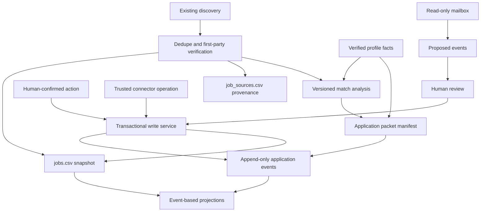

# Tracker v3 — последовательный implementation plan

Дата: 2026-09-22
Статус: proposed plan; Phase 0 active.

## 1. Цель

V3 добавляет versioned/event memory вокруг существующего canonical snapshot,
не превращая проект в generic CRM и не меняя trust model без необходимости.

Целевой пользовательский результат:

1. Для каждого отклика можно восстановить подтверждённую историю событий.
2. Можно доказать, какие JD, профиль, CV, cover letter и ответы составляли
   конкретный application packet.
3. Выставленный агентом match объясняется eligibility, evidence и confidence,
   а не только числом.
4. Состояние источника не смешивается с состоянием объявления.
5. Письмо может предложить lifecycle event, но не записать его без проверки.
6. Funnel и time-to-stage строятся из событий с известной семантикой.

## 2. Не-цели

- event sourcing как немедленная замена `jobs.csv`;
- Postgres/SQLite migration;
- full SPA или multi-user auth;
- автоматический final Submit;
- массовый historical inference из notes/email без evidence;
- новый scraper ради количества источников;
- изменение текущего search workflow до стабилизации core contracts.

## 3. Наследуемые invariants

1. `data/jobs.csv` остаётся canonical current snapshot в переходный период.
2. `data/job_sources.csv` остаётся provenance layer.
3. Все canonical writes проходят через общий transactional service.
4. Generated views не являются source of truth.
5. Human-only lifecycle events требуют explicit confirmation.
6. Discovery и inbox adapters не получают прямой write authority.
7. Unknown не превращается автоматически в pass, open или confirmed.
8. First-party evidence сильнее aggregator/source observation.
9. Один logical operation оставляет проверяемый audit trail.

## 4. Предлагаемая архитектура

Порядок важен: inbox и analytics зависят от стабильного event contract;
browser assistance зависит от packet contract; ни один из них не должен
проектировать core schema задним числом.

## 5. Delivery model

### Integration branch

`codex/tracker-v3` — опубликованная integration branch. Она может жить дольше
одного work package, поэтому:

- force-push запрещён;
- sync с `origin/main` оформляется явным merge checkpoint;
- canonical job operations продолжаются в `main` независимо;
- production CSV не мигрируется в середине разработки;
- код и tests разрабатываются на fixtures;
- final cutover начинается только от свежего `main` после повторного dry-run.

### Commit model

Рекомендуемый порядок commit'ов внутри work package:

1. contract/docs + failing tests/fixtures;
2. implementation;
3. migration dry-run tooling;
4. canonical migration/cutover;
5. generated views and final documentation.

Если все пункты образуют маленькую атомарную операцию, допускается один commit.
Миграция production data всегда отдельна от рефакторинга.

### Release slices

| Slice | Содержание | Можно остановиться после него? |
|---|---|---|
| v3-alpha.1 | event contract, validator, fixtures; без production write | да |
| v3-alpha.2 | atomic dual-write и timeline projection | да, с feature flag/compatibility path |
| v3-beta.1 | packet manifests | да |
| v3-beta.2 | evidence-backed match artifacts | да |
| v3-rc.1 | source health + migration rehearsal + docs | да |
| v3 stable | verified event/packet cutover и backward compatibility | да |
| post-v3 | inbox, analytics, contacts, browser assistance | независимо |

## 6. Phase 0 — governance, baseline и design freeze

Цель: убрать архитектурную неопределённость до первого изменения schema/code.

### WP0.1. Planning workspace

Статус: complete in current branch change.

Артефакты:

- plan;
- baseline;
- work log;
- decisions;
- open issues/blockers;
- risk register;
- verification matrix.

### WP0.2. Baseline and fixture inventory

Статус: baseline captured; fixture inventory remains.

Задачи:

1. Зафиксировать current validation/test/size metrics.
2. Выбрать 8–12 synthetic lifecycle scenarios:
   - applied without response;
   - recruiter screen → rejection;
   - assessment → interview → offer;
   - reschedule/cancel;
   - withdrawal;
   - wrong event corrected later;
   - duplicate/repost unrelated to application event;
   - listing closes after application.
3. Создать synthetic fixtures без персональных данных.
4. Зафиксировать expected snapshot projection для каждого scenario.

### WP0.3. Design decisions

До Gate 0 необходимо принять:

- физический формат event ledger;
- event identity и correction semantics;
- dual-write transaction boundary;
- минимальный event taxonomy;
- historical backfill precision;
- packet location/hash contract;
- compatibility strategy для `match_score` (D-010: итог выставляет агент).

### Gate 0

Первый срез WP1.1–WP1.2 получает статус `ready`, если:

- B-001, B-002 и B-004 resolved;
- event contract зафиксирован в D-003 или новом decision; полное принятие
  dual-write части D-003 остаётся условием Gate 1;
- synthetic scenarios утверждены;
- current branch синхронизирована с `main`;
- baseline validation green;
- implementation slice ограничен event contract + fixtures + validator.

B-003 закрывается до WP1.3 и production dual-write, B-005 — до WP1.5 и Gate 1.
D-004 принимается до Phase 2, D-005 — до Phase 3; они не блокируют event parser.

## 7. Phase 1 — append-only application event ledger

Цель: добавить подтверждённую историю, не делая `jobs.csv` derived и не ломая
существующий CLI/connector.

### WP1.1. Event contract

Определить:

- schema version;
- `event_id`, `job_id`, `event_type`;
- `occurred_at`, `recorded_at`, timezone и precision;
- source/actor/confirmation;
- `evidence_ref` и payload;
- correction/supersession;
- допустимые transitions и их связь со snapshot;
- canonical ordering при одинаковом времени события.

Минимальные event families:

- application submitted/confirmed;
- acknowledgement/response received;
- assessment invited/completed;
- recruiter/technical/final interview invited, scheduled, completed, cancelled;
- offer received/updated/declined/accepted;
- rejection received;
- candidate withdrawal;
- follow-up sent;
- correction/supersession metadata.

Не все event types обязаны менять `application_status` или `stage_reached`.

### WP1.2. Pure parser, validator and projections

Реализовать сначала read-only/pure layer:

- parse event artifact;
- schema validation;
- foreign key check на jobs;
- uniqueness/idempotency;
- deterministic ordering;
- correction chain validation;
- projection expected current status/stage/dates;
- mismatch report без записи.

Tests:

- valid scenario fixtures;
- malformed/unknown fields;
- duplicate IDs;
- missing job;
- out-of-order recorded time;
- ambiguous equal timestamps;
- correction loops;
- human-only event without confirmation;
- snapshot mismatch.

### WP1.3. Atomic write integration

Расширить общий transaction boundary так, чтобы одна операция либо:

- добавила event и обновила snapshot вместе;
- либо не изменила ни один artifact.

Нельзя иметь отдельные independent commands, один из которых пишет event, а
другой позже «догоняет» CSV.

Required fault tests:

- failure before event replacement;
- failure between event and CSV replacement;
- failure after prepared temp files;
- retry того же operation/event ID;
- stale connector precondition;
- concurrent operation race.

### WP1.4. CLI and connector contracts

Рассмотреть отдельную команду `event` или расширение `status`; не принимать
решение по названию до contract review.

CLI должен поддерживать:

- JSON input/output;
- dry-run/plan;
- explicit user confirmation для human-only events;
- evidence reference;
- stable machine-readable errors;
- exact changed-path enforcement в connector runner.

### WP1.5. Historical backfill

Backfill создаёт только то, что доказано structured snapshot:

- известный `applied_at` → событие с date precision;
- известный `response_at` и `stage_reached` → осторожный migration event;
- неизвестная последовательность не реконструируется;
- notes не парсятся автоматически;
- migration source и низкая precision обозначаются явно;
- повторный запуск идемпотентен.

До apply обязательны:

- `--check`/dry-run;
- count conservation;
- expected event count по категориям;
- temporary-copy rehearsal;
- rollback proof.

### WP1.6. Timeline projection

Добавить read-only human view:

- события по job;
- evidence/ref;
- corrected/superseded state;
- next commitment;
- без нового interactive UI.

### Gate 1

- event contract documented;
- event validator and projection deterministic;
- status operation atomic across event + snapshot;
- all existing commands backward compatible;
- historical migration is dry-run safe and idempotent;
- generated views fresh;
- full test suite green;
- rollback rehearsal documented;
- no source/inbox adapter can write events directly.

## 8. Phase 2 — versioned application packet manifest

Цель: сделать материалы конкретного отклика воспроизводимыми на byte level.

### WP2.1. Artifact inventory and schema

Определить:

- profile revision/content hash;
- JD source and hash;
- CV path/hash;
- cover letter path/hash или explicit `none`;
- custom answers;
- claims и evidence IDs;
- prepared/reviewed/submitted timestamps;
- packet schema version;
- immutable identity и correction/versioning.

### WP2.2. Packet CLI and validator

Команды должны уметь:

- создать manifest из explicit paths;
- проверить существование и SHA-256;
- показать stale/missing artifact;
- сравнить две версии packet;
- работать без LLM;
- не читать secrets/API keys.

### WP2.3. Lifecycle integration

- packet preparation не меняет `application_status`;
- review не означает submission;
- `submitted_at` появляется только с human-confirmed applied event;
- применённый packet ID связывается с событием, а не только с current row;
- изменение исходного файла после подготовки делает packet verification fail,
  но не переписывает historical hash.

### WP2.4. Existing data compatibility

- старые `cv_version`/`cover_letter` остаются валидными legacy snapshot fields;
- отсутствие packet у старого applied job — known legacy state, не validation
  error всей базы;
- новые submissions после cutover требуют packet либо explicit documented
  exception.

### Gate 2

- packet полностью воспроизводим;
- hash mismatch обнаруживается;
- exact submitted packet связан с event;
- никаких выдуманных claims;
- legacy data не ломает validation;
- personal artifacts не выводятся в logs/results.

## 9. Phase 3 — evidence-backed matching

Цель: разложить match на проверяемые компоненты, сохранив совместимость с
текущим `match_score`.

### WP3.1. Stable profile evidence IDs

Сначала определить адресуемые факты в `config/profile.md`:

- stable ID не должен зависеть только от номера строки;
- факт содержит source/evidence и допустимый scope;
- изменение текста не должно незаметно менять identity;
- удалённый факт должен инвалидировать зависимые новые analyses, но не стирать
  historical artifact.

### WP3.2. Versioned match artifact

Минимальные секции:

- job/profile revisions;
- atomic requirements;
- evidence links;
- assessment `strong|partial|missing|unknown`;
- confidence;
- eligibility blockers;
- preference/priority;
- version и явное обоснование итогового балла;
- human override with reason.

### WP3.3. Validated agent scoring

Агент извлекает requirements, предлагает evidence links и выставляет итоговый
`match_score` с rationale. Код отвечает за:

- schema и диапазон 1–10;
- видимость hard blockers и unknown рядом с баллом;
- разрешение evidence links;
- сохранение версии анализа и rationale;
- проверяемую совместимость с текущим `match_score`.

Формула, веса или автоматические caps не пересчитывают оценку агента без нового
решения. Golden corpus проверяет обоснованность и согласованность оценок.

### WP3.4. Golden corpus

Пилот на 20–30 уже проверенных вакансиях:

- набор blocker/no-blocker;
- разные seniority/geo/work authorization;
- requirement ambiguity;
- сравнение старой и новой рекомендации;
- review false positives/negatives;
- version-to-version diff.

### Gate 3

- один и тот же сохранённый artifact показывает один и тот же балл и rationale;
- unknown не становится pass;
- hard blockers видимы отдельно;
- evidence links разрешаются;
- golden corpus reviewed;
- historical analyses immutable/versioned;
- текущий tracker может показывать compatibility score без чтения всех artifacts.

## 10. Phase 4 — source health and observation freshness

Цель: видеть качество discovery без ложного изменения listing truth.

### Work packages

1. Run artifact contract: source, query set, start/end, result counts, error
   taxonomy, duration, adapter version.
2. Разделить `zero_results`, `blocked`, `auth_required`, `rate_limited`,
   `parse_error`, `partial`, `success`.
3. Хранить observation `last_seen_in_source` отдельно от first-party verification.
4. Добавить source health projection и quiet-board alert.
5. Запретить любой автоматический переход в `closed` из observation absence.

### Gate 4

- source run outcome воспроизводим;
- adapter failure не выглядит как zero jobs;
- absence не меняет canonical listing/application lifecycle;
- artifact retention и privacy определены;
- source workflows остаются read-only.

## 11. Phase 5 — read-only inbox reconciliation

Начинается только после Gate 1.

### WP5.1. Offline fixtures before OAuth

- synthetic `.eml`/sanitized text fixtures;
- deterministic rules;
- negation/hypothetical/process-description cases;
- message identity and dedupe;
- evidence excerpt with redaction;
- proposed event schema.

### WP5.2. Ambiguity classifier

- вызывается только после deterministic rules;
- structured output/schema validation;
- confidence и reason;
- prompt-injection boundary;
- no canonical write;
- regression fixture для каждой исправленной ошибки.

### WP5.3. Local credentialed reader

- read-only scope;
- credentials/session вне Git;
- bounded allowlist/query/time window;
- no raw full mailbox in logs/artifacts;
- local cursor/idempotency;
- explicit delete/retention procedure.

### WP5.4. Review and promotion

- proposal queue;
- source evidence preview;
- accept/reject/correct;
- accepted proposal становится normal authorized operation;
- `confirmed_by_user` возникает только в review action.

### Gate 5

- mailbox path cannot mutate canonical state;
- ambiguous messages never silently advance lifecycle;
- credentials and raw messages stay outside Git;
- retry is idempotent;
- accepted event passes the same validator as manual event;
- rejected proposal remains auditable without retaining unnecessary PII.

## 12. Phase 6 — event-based analytics

Начинается после накопления реальной event history.

Метрики:

- stage transitions and Sankey;
- time to first response;
- time in stage;
- interview/assessment rounds;
- follow-up debt;
- conversion by source/CV/packet revision;
- controllable weekly actions vs outcomes.

Правила:

- corrected/superseded events не считаются дважды;
- migration events с низкой precision не участвуют в точных duration metrics;
- cohort denominator documented;
- current status, furthest stage и traversed stages не смешиваются;
- every chart/table has a decision it supports.

### Gate 6

- golden analytical fixtures совпадают с ручным расчётом;
- повторный render детерминирован;
- empty/legacy datasets отображаются честно;
- metrics definitions documented рядом с output.

## 13. Phase 7 — contacts and outreach

Отдельное решение после inventory реальных данных.

Перед schema change измерить:

- сколько уникальных контактов уже встречается;
- повторяются ли recruiters между jobs;
- есть ли реальные referrals;
- сколько follow-ups выполняется;
- какие interaction types нужны.

Если потребность подтверждена, использовать отдельные contact/interaction
artifacts, а не добавлять `contact_2`, `last_contacted`, `linkedin_message` в
`jobs.csv`.

## 14. Phase 8 — deferred surfaces

Browser extension, SPA и database migration требуют отдельного research/design
gate. Минимальные prerequisites:

- stable packet contract;
- stable event contract;
- measured CLI/Markdown UX pain;
- threat model;
- maintenance budget;
- rollback and export plan.

## 15. Cross-cutting migration and rollback

Для каждой canonical migration:

1. Синхронизировать integration branch с свежим `main`.
2. Зафиксировать новый baseline.
3. Запустить migration на временной копии dataset.
4. Проверить row/event/source conservation.
5. Проверить idempotent second run.
6. Проверить fault injection между заменами файлов.
7. Сохранить Git diff и generated outputs для review.
8. Выполнить migration отдельным commit.
9. Прогнать полный CI-equivalent gate.
10. Rollback выполняется `git revert` конкретного migration commit, не ручным
    редактированием canonical файлов.

## 16. Definition of Done v3 core

Core v3 готов, если:

1. Существующие 458+ jobs и source references проходят migration без потерь.
2. Human-confirmed status operation атомарно создаёт event и обновляет snapshot.
3. Retry не создаёт duplicate event.
4. Correction сохраняет старое событие и однозначно меняет projection.
5. Старые записи без точной истории остаются явно legacy/low precision.
6. Application packet проверяет точные bytes материалов.
7. Applied event ссылается на использованный packet или explicit exception.
8. Match artifact разделяет eligibility/evidence/confidence/preference.
9. Current CLI и connector v1 остаются совместимы либо имеют документированную
   migration path.
10. Discovery/source workflows остаются read-only.
11. Full tests, strict validation и all freshness checks green.
12. Current architecture, schema, CLI docs, AGENTS и roadmap обновлены в cutover
    commit.
13. Rollback rehearsal выполнен на свежей копии данных.
14. Bootstrap context не требует чтения полного event/packet/match corpus.

## 17. Рекомендуемый первый implementation slice

После Gate 0 выполнить только WP1.1–WP1.2:

1. принять event contract;
2. добавить synthetic fixtures;
3. реализовать pure parser/validator/projection;
4. добавить mismatch report;
5. прогнать verification matrix;
6. обновить decisions, issues и work log;
7. остановиться для review.

Не включать в первый slice production dual-write, backfill, inbox, analytics или
packet manifests. Сначала event semantics должны стать устойчивыми.
